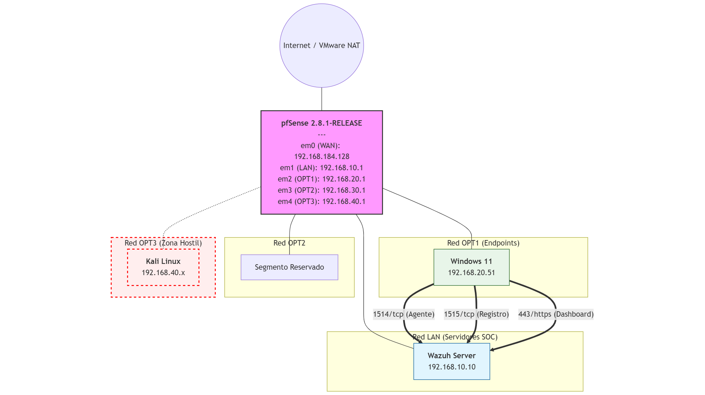

# Arquitectura del laboratorio SOC con Wazuh y pfSense

## 1. Componentes principales

- **Firewall / Router**: pfSense 2.8.1-RELEASE (amd64) sobre máquina virtual VMware.
- **Servidor Wazuh**:
  - Hostname: `wazuh-server`
  - IP: `192.168.10.10`
  - Red: `LAN` (192.168.10.0/24)
- **Endpoint Windows 11** (equipo monitorizado y también consola de administración):
  - Hostname: `DESKTOP-IS5MQHK`
  - IP: `192.168.20.51`
  - Red: `OPT1` (192.168.20.0/24)
- **Kali Linux** (máquina atacante):
  - Red: `OPT3` (192.168.40.0/24)
  - IP: `192.168.40.x` (dentro del rango OPT3)
- **Host físico**:
  - PC personal con VMware, que aloja pfSense, Wazuh, Windows 11 y Kali.
  - Desde el host de Windows 11, se accede al WebGUI de pfSense y al dashboard de Wazuh.

---

## 2. Plan de direccionamiento

### 2.1 Interfaces de pfSense

Según la consola de pfSense y el Dashboard:

| Interfaz | Nombre lógico | IP pfSense        | Red / Máscara       | Rol en el lab                            |
|----------|---------------|-------------------|---------------------|------------------------------------------|
| em0      | WAN           | 192.168.184.128   | 192.168.184.0/24    | Salida hacia la red externa / VMware NAT |
| em1      | LAN           | 192.168.10.1      | 192.168.10.0/24     | Red interna de servidores (Wazuh)        |
| em2      | OPT1          | 192.168.20.1      | 192.168.20.0/24     | Red de endpoints (Windows 11)            |
| em3      | OPT2          | 192.168.30.1      | 192.168.30.0/24     | Segmento reservado para usos futuros     |
| em4      | OPT3          | 192.168.40.1      | 192.168.40.0/24     | Red atacante (Kali Linux)                |

### 2.2 Direccionamiento de hosts

| Dispositivo      | Red   | IP               | Notas                                           |
|------------------|-------|------------------|-------------------------------------------------|
| pfSense (LAN)    | LAN   | 192.168.10.1     | Puerta de enlace de la red LAN                 |
| Wazuh server     | LAN   | 192.168.10.10    | Servidor SOC (manager + indexer + dashboard)   |
| pfSense (OPT1)   | OPT1  | 192.168.20.1     | Gateway de la red de endpoints                 |
| Windows 11       | OPT1  | 192.168.20.51    | Endpoint monitorizado y consola de administración |
| pfSense (OPT3)   | OPT3  | 192.168.40.1     | Gateway de la red atacante                     |
| Kali Linux       | OPT3  | 192.168.40.x     | Máquina de pruebas de ataque                    |

---

## 3. Flujo de tráfico y segmentación

### 3.1 Tráfico entre Windows 11 y Wazuh

- **Origen**: Windows 11 (`192.168.20.51`, red OPT1).
- **Destino**: Wazuh server (`192.168.10.10`, red LAN).
- **Paso**: pfSense enruta de OPT1 → LAN.
- **Puertos clave**:
  - `1514/tcp` (comunicación del agente Wazuh hacia el manager).
  - `1515/tcp` (registro de agentes).
  - Otros puertos agrupados en el alias `WAZUH_PORTS` (API, dashboard, etc.).

La interfaz OPT1 tiene reglas específicas que permiten desde `OPT1 subnets` hacia `192.168.10.10` en esos puertos.

### 3.2 Acceso de administración

- Acceso al WebGUI de pfSense:
  - URL: `https://192.168.10.1/`
  - Desde el propio Windows 11 (192.168.20.51), enrutado a través de pfSense.
- Acceso al dashboard de Wazuh:
  - Desde el mismo Windows 11, hacia `192.168.10.10` en los puertos de la consola web definidos en `WAZUH_PORTS`.

### 3.3 Red atacante (OPT3 – Kali)

- Red: `192.168.40.0/24`.
- pfSense tiene una regla muy restrictiva en OPT3: solo permite ICMP desde `OPT3 subnets` hacia el propio firewall.
- En este despliegue incial, no hay acceso directo desde Kali a Wazuh ni a LAN, lo que permite simular un atacante externo controlado en Fase 2 sin comprometer la gestión.

### 3.4 WAN

- WAN (`192.168.184.128/24`) se usa como salida a Internet (típicamente detrás de NAT de VMware).
- En la interfaz WAN solo existen las reglas por defecto para:
  - Bloquear redes privadas RFC1918.
  - Bloquear bogon networks.

---

## 4. Diagrama de red (descripción)

- **Capa externa**
  - `Internet / Red VMware` → `pfSense (WAN 192.168.184.128)`

- **Segmentos internos**
  - `pfSense LAN 192.168.10.1` → `Wazuh server 192.168.10.10`
  - `pfSense OPT1 192.168.20.1` → `Windows 11 192.168.20.51`
  - `pfSense OPT3 192.168.40.1` → `Kali Linux 192.168.40.x`

Con reglas de firewall que:

- Permiten solo el tráfico necesario de OPT1 → Wazuh.
- Mantienen a OPT3 aislado salvo ICMP.
- Bloquean redes privadas y bogons en WAN.

