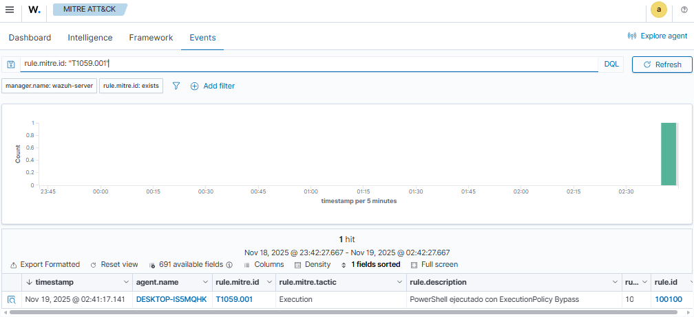
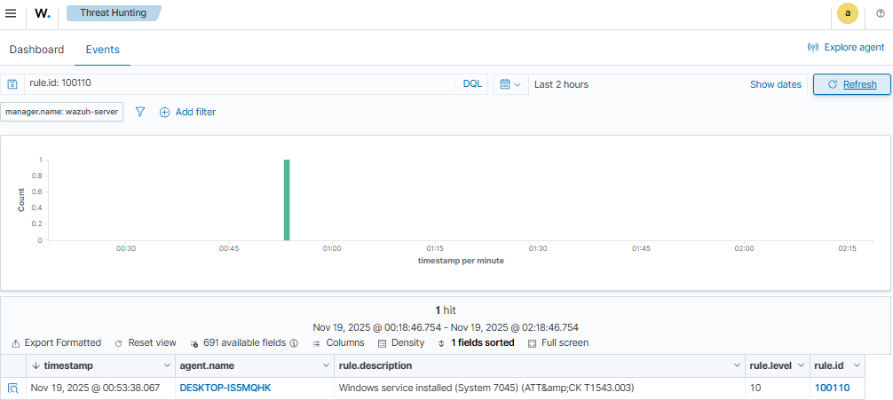
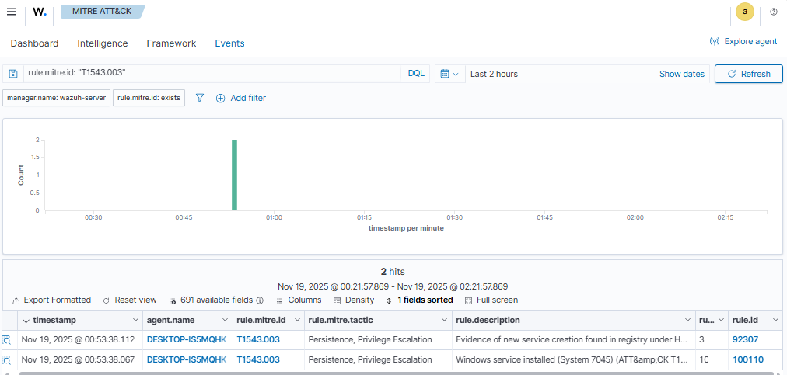
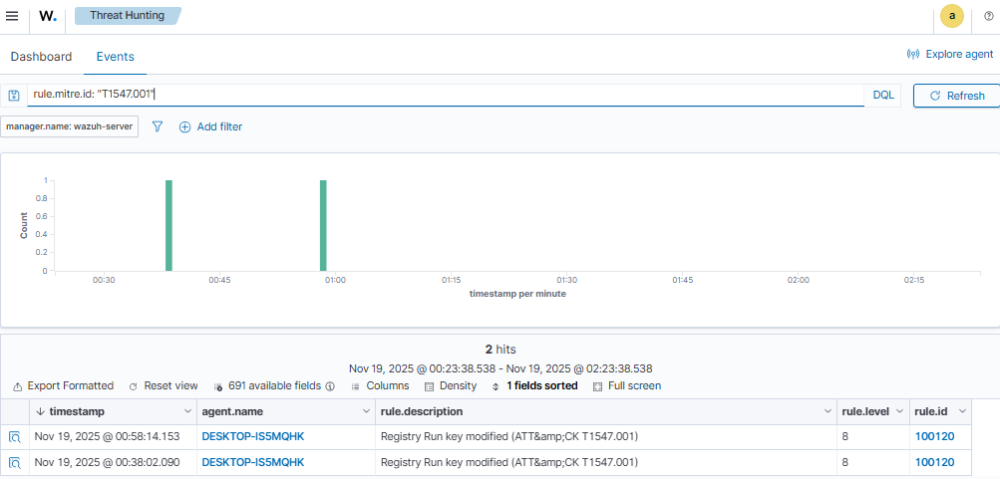
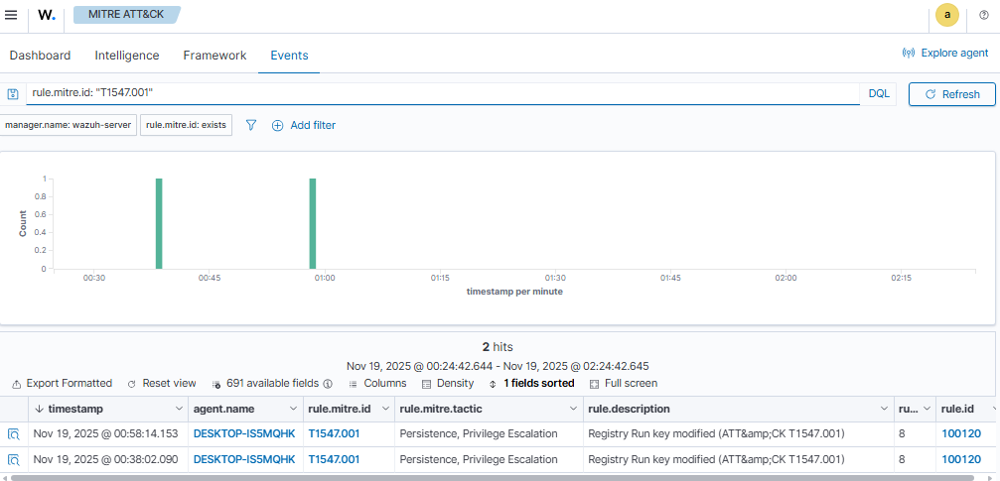

# Fase 1 - Base endurecida y calidad de señal en Wazuh
## 1. Objetivo

Establecer una base segura para el laboratorio SOC con Wazuh, pfSense y un endpoint Windows, y validar la calidad de señal de los logs mediante:
- Recolección de eventos de Windows (Security, System, Application, Sysmon).
- File Integrity Monitoring (FIM) y monitoreo de registro en rutas de persistencia.
- Creación de 3 reglas personalizadas mapeadas a MITRE ATT&CK:
  - **T1059.001** – Command and Scripting Interpreter: PowerShell.
  - **T1543.003** – Create or Modify System Process: Windows Service.
  - **T1547.001** – Boot or Logon Autostart Execution: Registry Run Keys.

---

## 2. Arquitectura del laboratorio

- **Firewall**: pfSense (segmentación de la red de laboratorio).
- **Servidor Wazuh**: `wazuh-server` (IP: `192.168.10.10`).
- **Endpoint Windows 10**: `DESKTOP-ISS...` (IP ejemplo `192.168.20.51`).
  - Sysmon instalado y configurado.
  - Agente Wazuh con recolección de:
    - EventChannel: Application, Security, System.
    - EventChannel: `Microsoft-Windows-Sysmon/Operational`.

> *(Aquí puedes insertar una imagen del diagrama de red, por ejemplo  
> ``)*

---

## 3. Configuración relevante

### 3.1 Agente Wazuh en Windows (ossec.conf)

Fragmento relevante de **File Integrity Monitoring / Registry**:

```xml
<syscheck>
  <disabled>no</disabled>
  <frequency>43200</frequency>

  <!-- Directorios clave y binarios de sistema -->
  <directories recursion_level="0" restrict="powershell.exe$">%WINDIR%\System32\WindowsPowerShell\v1.0</directories>
  ...

  <!-- Claves de registro de servicios y persistencia -->
  <windows_registry>HKEY_LOCAL_MACHINE\System\CurrentControlSet\Services</windows_registry>
  ...
  <windows_registry arch="both">HKEY_LOCAL_MACHINE\Software\Microsoft\Windows\CurrentVersion\Run</windows_registry>
  <windows_registry arch="both">HKEY_LOCAL_MACHINE\Software\Microsoft\Windows\CurrentVersion\RunOnce</windows_registry>
  ...
  <!-- Persistencia por usuario -->
  <windows_registry arch="both">HKEY_CURRENT_USER\Software\Microsoft\Windows\CurrentVersion\Run</windows_registry>
  <windows_registry arch="both">HKEY_CURRENT_USER\Software\Microsoft\Windows\CurrentVersion\RunOnce</windows_registry>
  ...
</syscheck>
```

(En el repo puedes incluir el `ossec.conf` completo en `configs/agents/windows10-lab-ossec.conf`)

## 3.2 Reglas locales MITRE (local_rules.xml)

```xml
<!-- T1059.001 – PowerShell ExecutionPolicy Bypass -->
<group name="local,powershell,windows,">
  <rule id="100100" level="10">
    <if_sid>61603</if_sid>
    <field name="win.eventdata.commandLine" type="pcre2">(?i)-ExecutionPolicy\s*Bypass</field>
    <description>PowerShell ejecutado con ExecutionPolicy Bypass</description>
    <mitre>
      <id>T1059.001</id>
    </mitre>
    <group>execution,mitre,</group>
  </rule>
</group>

<!-- T1543.003 – Servicios instalados -->
<group name="windows,services,attack.t1543.003">
  <rule id="100110" level="10">
    <if_group>windows</if_group>
    <field name="win.system.eventID" type="pcre2">^7045$</field>
    <description>Windows service installed (System 7045) (ATT&amp;CK T1543.003)</description>
    <mitre><id>T1543.003</id></mitre>
  </rule>
  <rule id="100111" level="10">
    <if_group>windows</if_group>
    <field name="win.system.eventID" type="pcre2">^4697$</field>
    <description>Windows service installed (Security 4697) (ATT&amp;CK T1543.003)</description>
    <mitre><id>T1543.003</id></mitre>
  </rule>
</group>

<!-- T1547.001 – Persistencia Run/RunOnce via Sysmon (rule 92302) -->
<group name="windows,registry,persistence,attack.t1547.001">
  <rule id="100120" level="8">
    <if_sid>92302</if_sid>
    <field name="win.eventdata.targetObject" type="pcre2">(?i)\\\\Software\\\\Microsoft\\\\Windows\\\\CurrentVersion\\\\Run</field>
    <description>Registry Run key modified (ATT&amp;CK T1547.001)</description>
    <mitre><id>T1547.001</id></mitre>
    <group>persistence,mitre,</group>
  </rule>

  <rule id="100121" level="8">
    <if_sid>92302</if_sid>
    <field name="win.eventdata.targetObject" type="pcre2">(?i)HKEY_CURRENT_USER\\\\Software\\\\Microsoft\\\\Windows\\\\CurrentVersion\\\\Run</field>
    <description>HKCU Run modified (ATT&amp;CK T1547.001)</description>
    <mitre><id>T1547.001</id></mitre>
    <group>persistence,mitre,</group>
  </rule>
</group>
```
## 4. Pruebas realizadas

### 4.1 T1059.001 – PowerShell ExecutionPolicy Bypass

- **Comando ejecutado (Windows, CMD):**
```cmd
powershell.exe -ExecutionPolicy Bypass -NoProfile -Command "Write-Host 'Test T1059.001 Wazuh'"
```
- **Búsquedas en Wazuh:**
    
    - Threat Hunting: `rule.id: 100100`
        
    - MITRE ATT&CK → Events: `rule.mitre.id: "T1059.001"`
        
- **Evidencias:**
    
    - Threat Hunting:  
        
        
        
        
    - MITRE ATT&CK – Events:  
        
        
        
### 4.2 T1543.003 – Creación de servicios

- **Comando de prueba:**
```cmd
sc.exe create WazuhTestSvc binPath= "C:\Windows\System32\cmd.exe /c ping 127.0.0.1 -n 3" start= demand
sc.exe start WazuhTestSvc
sc.exe delete WazuhTestSvc
```
- **Búsquedas:**
    
    - Threat Hunting: `rule.id: 100110`
        
    - MITRE ATT&CK – Events: `rule.mitre.id: "T1543.003"`
        
- **Evidencias:**
    
          
    
### 4.3 T1547.001 – Persistencia Run / RunOnce

- **Comando de prueba (HKCU):**
 ```cmd
 reg add "HKCU\Software\Microsoft\Windows\CurrentVersion\Run" /v WazuhTestRun /t REG_SZ /d "C:\Windows\System32\notepad.exe" /f
 ```
 - **Búsquedas:**
    
    - Threat Hunting: `rule.mitre.id: "T1547.001"`
        
    - MITRE ATT&CK – Events: `rule.mitre.id: "T1547.001"`
        
- **Evidencias:**
    
    
        
    
## 5. Resultados y lecciones aprendidas

- La instalación de Sysmon y la configuración de `ossec.conf` permiten una buena “calidad de señal”:
    
    - Alta cobertura de procesos, servicios, registro y tareas.
        
- Durante la fase se identificaron y corrigieron varios problemas:
    
    - Regla T1547.001 inicialmente dependía del grupo `syscheck`; se ajustó para ser hija de `if_sid:92302` (Sysmon Registry).
        
    - La regla T1059.001 no disparaba mientras incluía `decoded_as="json"`; se eliminó ese filtro y se enganchó a `if_sid:61603`.
        
    - Para que el módulo MITRE mostrara los eventos, fue necesario ejecutar `wazuh-db update`.
        
- La Fase 1 queda completada con 3 reglas personalizadas funcionales y visibilidad clara en:
    
    - Threat Hunting.
        
    - Módulo MITRE ATT&CK (tácticas/ técnicas asociadas al host Windows del laboratorio).
## 6. Integración pfSense + Wazuh + Sysmon en Fase 1

### 6.1 Rol del endpoint Windows 11 (OPT1)

Durante la Fase 1, todas las pruebas se ejecutan desde el equipo **Windows 11** ubicado en la red **OPT1 (192.168.20.0/24)**. Este equipo cumple dos funciones:

- Actúa como **endpoint monitorizado** por Wazuh (con agente + Sysmon).
- Sirve como **consola de administración** del laboratorio:
  - Acceso al WebGUI de pfSense mediante `https://192.168.10.1/`.
  - Acceso al dashboard de Wazuh en `192.168.10.10`.

Desde este Windows se lanzan los comandos de **PowerShell**, la creación de **servicios** y las modificaciones de **registro** que disparan las reglas personalizadas asociadas a MITRE ATT&CK (T1059.001, T1543.003, T1547.001).

---

### 6.2 pfSense como segmentador y control de tráfico

pfSense se utiliza para **segmentar el laboratorio** de forma similar a una red corporativa:

- **LAN (192.168.10.0/24)**: red de servidores, donde se encuentra el **Wazuh server (192.168.10.10)**.
- **OPT1 (192.168.20.0/24)**: red de **endpoints**, donde está el Windows 11 monitorizado.
- **OPT3 (192.168.40.0/24)**: red de **atacante**, donde se encuentra la máquina Kali Linux.

El firewall controla qué tráfico llega al Wazuh server. En Fase 1 se habilitan de forma explícita:

- Conexiones desde **OPT1 → Wazuh server** en:
  - `1514/tcp` (envío de logs del agente Wazuh).
  - `1515/tcp` (registro de agentes).
  - Puertos agrupados en el alias `WAZUH_PORTS` (dashboard y API de Wazuh).

De esta forma, pfSense:

- Aísla la red del atacante (OPT3).
- Separa servidores (LAN) de endpoints (OPT1).
- Asegura que solo el tráfico necesario llegue al Wazuh server, lo que refuerza la idea de “base endurecida” de la Fase 1.

---

### 6.3 Sysmon + agente Wazuh en el endpoint

En el Windows 11 se combina:

- **Sysmon** para generar telemetría de bajo nivel:
  - Creación de procesos (Event ID 1).
  - Creación de archivos (Event ID 11).
  - Cambios de registro (Event ID 13), entre otros.
- **Agente Wazuh** configurado para leer el canal:
  - `Microsoft-Windows-Sysmon/Operational` (vía `log_format: eventchannel`).

Este flujo es:

1. Sysmon registra eventos detallados (por ejemplo, el uso de `powershell.exe -ExecutionPolicy Bypass`, creación de servicios, modificaciones de Run/RunOnce).
2. El agente Wazuh en el Windows envía esos eventos al **Wazuh server** a través de pfSense.
3. En el Wazuh server se aplican:
   - Reglas base del ruleset (IDS/IPS, Sysmon, Windows).
   - Reglas locales creadas en la Fase 1:
     - **100100 → T1059.001** (PowerShell con `ExecutionPolicy Bypass`).
     - **100110/100111 → T1543.003** (instalación de servicios, eventos 7045/4697).
     - **100120/100121 → T1547.001** (modificación de claves Run/RunOnce).

Las alertas resultantes se visualizan en:

- **Threat Hunting** (detalle de cada evento).
- **MITRE ATT&CK → Events**, donde quedan asociadas a las tácticas y técnicas correspondientes.

En conjunto, pfSense, Sysmon y Wazuh forman la base de la Fase 1:

- pfSense asegura y segmenta el tráfico.
- Sysmon genera la telemetría de sistema.
- Wazuh correlaciona esa telemetría y la mapea contra MITRE ATT&CK mediante las reglas personalizadas.
### 6.4 Política de Sysmon aplicada en Fase 1

En el endpoint Windows 11 de la red OPT1 se utiliza **Sysmon v15.15** con una configuración avanzada almacenada en:

- **Config file**: `C:\Temp\Sysmon\sysmonconfig-export.xml`
- **HashingAlgorithms**: `MD5`, `SHA256`, `IMPHASH`
- **Network connection logging**: `enabled`
- **DNS lookup**: `enabled`
- **Image loading**: `disabled` (no se registran todos los módulos cargados para reducir ruido)

Esta configuración no es la default, sino una política endurecida que se centra en:

#### 6.4.1 ProcessCreate (creación de procesos)

Sysmon tiene reglas de inclusión específicas para procesos de scripting y administración, por ejemplo:

- `Image = powershell.exe`
- `Image = pwsh.exe`

y se marcan especialmente los casos donde la línea de comandos contiene:

- `-enc`, `encodedcommand`
- `-nop`, `NoProfile`
- `Bypass`
- `Invoke-Expression`
- `DownloadString`
- `FromBase64String`

A la vez, existe una lista extensa de **exclusiones** para procesos y comandos legítimos del sistema (por ejemplo `svchost.exe` con parámetros estándar, servicios de Windows, Office, Edge, Chrome, Defender, etc.), con el objetivo de:

- **Reducir el ruido de eventos “normales”**.
- **Resaltar procesos potencialmente maliciosos**, sobre todo cuando usan construcciones típicas de ataque en PowerShell.

Esta telemetría es la que consume Wazuh en el canal `Microsoft-Windows-Sysmon/Operational` y que permite que la regla local **100100 (T1059.001)** se active al detectar:

```txt
powershell.exe -ExecutionPolicy Bypass -NoProfile ...
```
#### 6.4.2 FileCreateTime y FileCreate

La política también monitoriza la creación de archivos, enfocándose en:

- Rutas y extensiones sensibles, por ejemplo:
    
    - `C:\Users\...`, `C:\Windows\Temp`, `Downloads`, `Startup`, etc.
        
    - Extensiones como `.exe`, `.dll`, `.sys`, `.ps1`, `.vbs`, `.bat`, `.cmd`, `.jar`, `.hta`, `.lnk`, `.docm`, `.xlsm`, etc.
        
- Directorios de sistema relevantes (`Drivers`, `Tasks`, `WindowsPowerShell`, `GroupPolicy`, etc.).
    

Esto permite:

- Detectar binarios y scripts potencialmente maliciosos que se escriben en ubicaciones clave de persistencia o ejecución.
    
- Complementar las detecciones de Wazuh basadas en creación de servicios, scripts de inicio, tareas programadas, etc.
    

#### 6.4.3 NetworkConnect

La configuración de Sysmon registra conexiones de red originadas por:

- Imágenes consideradas de riesgo o interés:
    
    - `cmd.exe`, `powershell.exe`, `wscript.exe`, `cscript.exe`, `regsvr32.exe`, `mshta.exe`, `rundll32.exe`, `bitsadmin.exe`, `wmic.exe`, `psexec.exe`, `ncat.exe`, `nc.exe`, `tor.exe`, `vnc*`, `nmap.exe`, etc.
        
- Puertos de destino típicamente sospechosos:
    
    - `22`, `23`, `25`, `143`, `3389`, `5800`, `5900`, `4444`, `1080`, `3128`, `8080`, `1723`, `9001`, `9030`, entre otros.
        

De esta forma, si en Fases posteriores se simulan conexiones maliciosas desde herramientas de pentesting o payloads, Sysmon ya está preparado para registrar esa actividad y Wazuh puede correlacionarla.

#### 6.4.4 RegistryEvent (cambios en el registro)

La política de Sysmon incluye reglas detalladas para **RegistryEvent**, centradas en claves de:

- **Persistencia y arranque**:
    
    - `CurrentVersion\Run`, `CurrentVersion\RunOnce`
        
    - `Policies\Explorer\Run`
        
    - `CurrentVersion\Windows\Run`, `Load`
        
    - Claves de `Winlogon` (`Shell`, `Userinit`, `Notify`, etc.)
        
    - Ubicaciones de scripts de Group Policy (`Group Policy\Scripts`)
        
- **Seguridad, RDP, firewall y proxy**:
    
    - Parámetros de Terminal Server / RDP (`RDP-Tcp\PortNumber`, `fDenyTSConnections`).
        
    - Políticas de firewall y aplicaciones autorizadas.
        
    - Configuración de proxy e Internet Settings.
        
    - Configuración de Windows Defender / antivirus, exclusiones y flags de desactivación.
        

Esta parte de Sysmon es la que habilita detecciones como:

- Modificaciones de claves `Run` y `RunOnce` que Wazuh mapea a **T1547.001 (Registry Run Keys)** mediante las reglas locales **100120 / 100121** (que se apoyan en `if_sid: 92302`, correspondiente a eventos de registro de Sysmon).
    

---

En resumen, la política de Sysmon en Fase 1:

- Proporciona **telemetría rica y filtrada** (menos ruido, más señales relevantes).
    
- Está directamente alineada con las técnicas que se desean detectar en Wazuh:
    
    - `ProcessCreate` para **T1059.001 – PowerShell**.
        
    - `RegistryEvent` en claves de persistencia para **T1547.001**.
        
- Deja preparado el terreno para que, en Fases posteriores, se puedan añadir reglas locales adicionales en Wazuh basadas en:
    
    - Creación de archivos sospechosos.
        
    - Conexiones de red de herramientas específicas (nmap, psexec, etc.).
        
    - Cambios de registro en áreas críticas de seguridad y ejecución.