# Fase 2 - Plan de pruebas y resultados
## 1. Matriz de pruebas ejecutadas

| #   | Técnica MITRE | Descripción prueba                          | Bloque | Estado                                                                                            | Sección detalle |
| --- | ------------- | ------------------------------------------- | ------ | ------------------------------------------------------------------------------------------------- | --------------- |
| 1   | T1059.001     | PowerShell ExecutionPolicy Bypass           | A      | OK – Regla local 100100 + mapeo MITRE                                                             | 2.1             |
| 2   | T1543.003     | Creación de servicio (sc.exe)               | A      | OK – Reglas locales 100110 / 100111 + mapeo MITRE                                                 | 2.2             |
| 3   | T1547.001     | Persistencia Run / RunOnce                  | A      | OK – Reglas locales 100120 / 100121 + mapeo MITRE                                                 | 2.3             |
| 4   | T1105         | Descarga de fichero (Ingress Tool Transfer) | B      | OK – Sin regla local, cubierta por regla oficial Sysmon (92213)                                   | 3.1 & 3.7       |
| 5   | T1053.005     | Creación de tarea programada (schtasks.exe) | B      | OK – Regla local 100150 basada en Security 4688 + mapeo MITRE                                     | 3.2 & 3.6       |
| 6   | T1082         | System Information Discovery                | B      | OK – Regla local 100130 (Security 4688, systeminfo / whoami / ipconfig) + mapeo MITRE             | 3.3 & 3.4       |
| 7   | T1016         | System Network Configuration Discovery      | B      | OK – Regla local 100140 (arp / netstat / route / ipconfig) + mapeo MITRE                          | 3.5             |
| 8   | T1087         | Account Discovery (net user)                | B      | OK – Regla local 100141 (Security 4688, `net.exe`/`net1.exe` con "net user") + mapeo MITRE \| 3.8 |                 |

\* OK = técnica detectada y visible en Threat Hunting/MITRE con reglas claras (locales u oficiales).

\* OK = evento detectado en Threat Hunting. En T1053 y T1082 todavía no hay una regla MITRE específica, solo eventos de Sysmon/Windows que se pueden usar para crear reglas locales más adelante. 

---

## 2. Bloque A – Revalidación de técnicas con reglas locales

Este bloque revalida en Fase 2 las tres técnicas que ya se habían configurado en la Fase 1 con reglas locales y mapeo a MITRE.

### 2.1 T1059.001 – Command and Scripting Interpreter: PowerShell

**Objetivo**  
Confirmar que la regla local `100100` sigue detectando la ejecución de PowerShell con `ExecutionPolicy Bypass` y que la alerta aparece en la vista MITRE asociada a **T1059.001**.

**Comando ejecutado en Windows 11 (OPT1)**

```cmd
powershell.exe -ExecutionPolicy Bypass -NoProfile -Command "Write-Host 'Fase2 T1059.001 test 1'"
```

**Búsquedas realizadas en Wazuh**

- Threat Hunting:
    
    - `rule.id: 100100`
        
    - o `rule.description: "PowerShell ejecutado con ExecutionPolicy Bypass"`
        
- MITRE → Events:
    
    - `rule.mitre.id: "T1059.001"`
        
    - `agent.name: DESKTOP-IS5MQHK`
        

**Evidencias**

Figura 1 – T1059.001 en Threat Hunting (regla 100100):
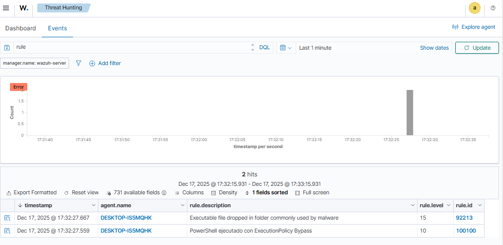

Figura 2 – T1059.001 en MITRE ATT&CK → Events:
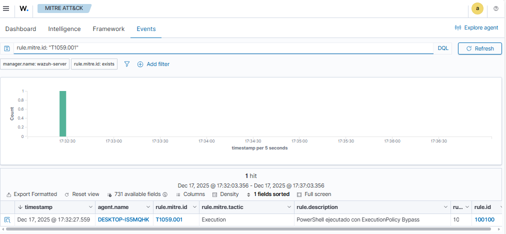

**Resultado**

- La regla `100100` se dispara correctamente.
    
- La alerta aparece en MITRE como técnica **T1059.001 – Command and Scripting Interpreter: PowerShell**.
    
- Se considera la detección **OK**.

### 2.2 T1543.003 – Create or Modify System Process: Windows Service

**Objetivo**  
Validar la detección de creación de servicios maliciosos a través de los eventos 7045/4697 y las reglas locales `100110` / `100111`, mapeadas a **T1543.003**.

**Comandos ejecutados en Windows 11 (CMD como administrador)**

```cmd
sc.exe create WazuhFase2Svc binPath= "C:\Windows\System32\cmd.exe /c ping 127.0.0.1 -n 3" start= demand
sc.exe start WazuhFase2Svc
sc.exe delete WazuhFase2Svc
```
**Búsquedas realizadas en Wazuh**

- Threat Hunting:
    
    - `rule.id: 100110 OR rule.id: 100111`
        
- MITRE → Events:
    
    - `rule.mitre.id: "T1543.003"`
        

**Evidencias**

Figura 3 – T1543.003 en Threat Hunting (regla 100110/100111):
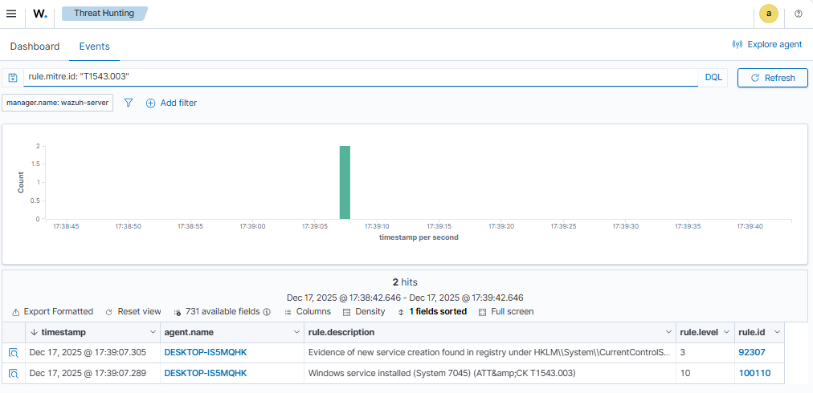


Figura 4 – T1543.003 en MITRE ATT&CK → Events:
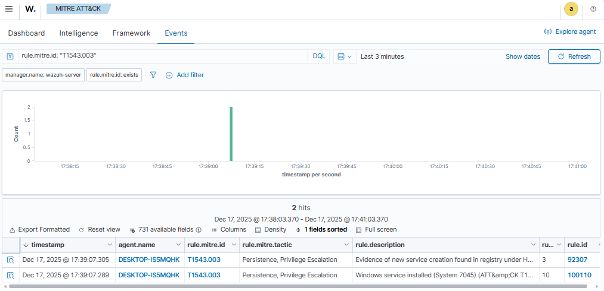

**Resultado**

- Se detecta la creación de servicio mediante los eventos de Windows (`eventID` 7045/4697).
    
- Las reglas locales etiquetan correctamente la técnica **T1543.003**.
    
- Detección **OK**.

### 2.3 T1547.001 – Registry Run Keys / RunOnce

**Objetivo**  
Confirmar que las reglas locales `100120` y `100121`, basadas en eventos de Sysmon/registro, detectan modificaciones en las claves Run / RunOnce y se mapean a **T1547.001**.

**Comando ejecutado en Windows 11**
```cmd
reg add "HKCU\Software\Microsoft\Windows\CurrentVersion\Run" /v WazuhFase2Run /t REG_SZ /d "C:\Windows\System32\notepad.exe" /f
```
(Posteriormente se puede limpiar con:)
```cmd
reg delete "HKCU\Software\Microsoft\Windows\CurrentVersion\Run" /v WazuhFase2Run /f
```

**Búsquedas realizadas en Wazuh**
- Threat Hunting:
    
    - `rule.id: 100120 OR rule.id: 100121`
        
- MITRE → Events:
    
    - `rule.mitre.id: "T1547.001"`
        

**Evidencias**
Figura 5 – T1547.001 en Threat Hunting (regla 100120/100121):
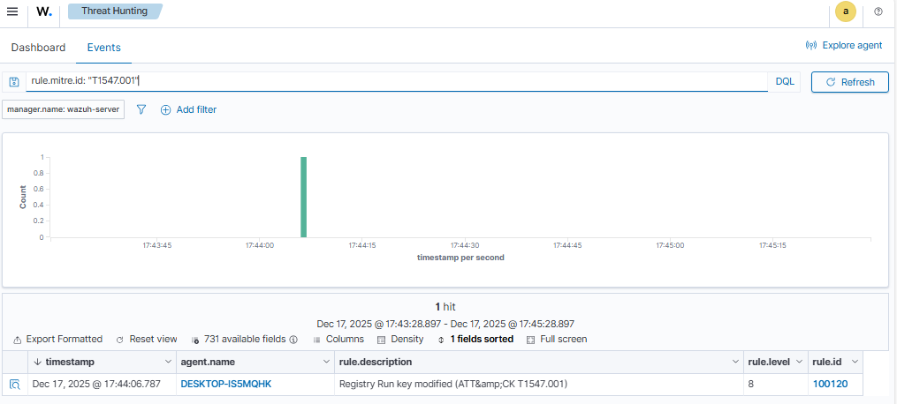

Figura 6 – T1547.001 en MITRE ATT&CK → Events:
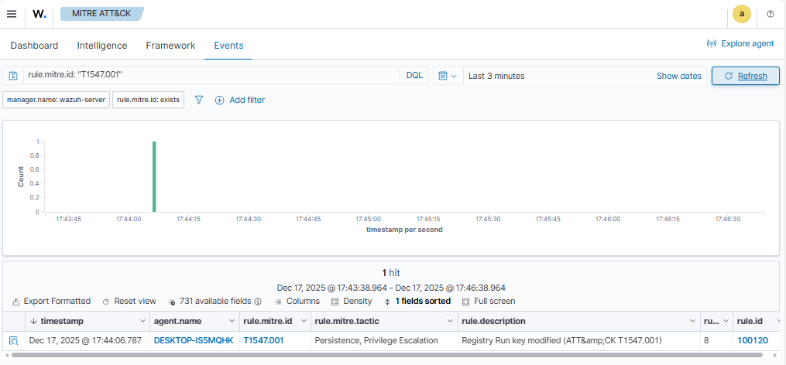

**Resultado**

- Las modificaciones en las claves `Run` / `RunOnce` son detectadas.
    
- Las alertas se mapean a **T1547.001** en MITRE.
    
- Detección **OK**.

## 3. Bloque B – Técnicas nuevas observadas

Este bloque introduce técnicas que no estaban explicitamente en la Fase 1 y verifica qué tan bien las detecta el ruleset actual de Wazuh + Sysmon.

### 3.1 T1105 – Ingress Tool Transfer

**Objetivo**  
Validar la detección de descarga de ficheros hacia el endpoint Windows 11 (movimiento de herramientas hacia el host).

**Comando ejecutado en Windows 11 (PowerShell)**
```powershell
powershell.exe -NoProfile -Command "Invoke-WebRequest -Uri 'https://example.com' -OutFile $env:TEMP\fase2-t1105-test.txt"
```

**Búsquedas realizadas en Wazuh**

- Threat Hunting:
    - `rule.mitre.id: "T1105"` o `rule.id: 92213`
    - o búsqueda por:
        - `data.win.system.eventID: 11` (FileCreate)
        - `data.win.eventdata.targetFilename` con ruta en `%TEMP%` y nombre `fase2-t1105-test.txt`.
            
- Se revisa si dispara la regla `92213` (o similar) que ya se había observado para descargas en Temp.

**Evidencias**

Figura 7 – rule.id: 92213 or rule mitre.mitre.id: T1105 en Threat Hunting (regla basada en FileCreate en Temp):
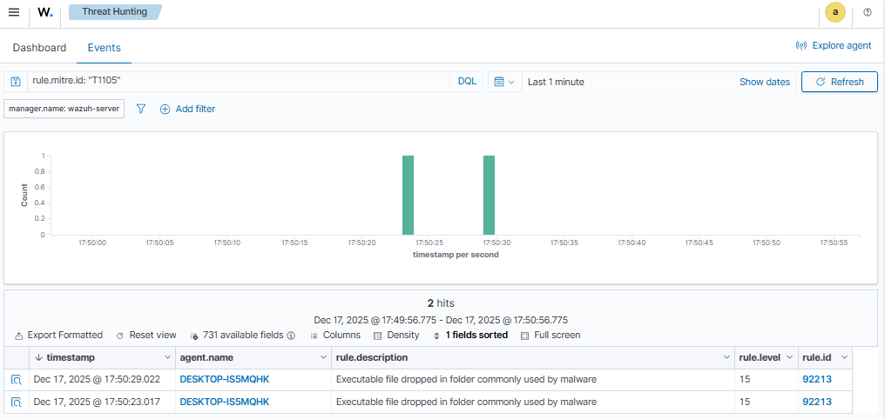

Figura 8 – T1105 en MITRE ATT&CK → Events:
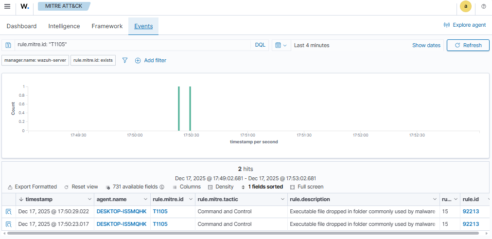

**Resultado**

- Se detecta la creación del fichero en `%TEMP%`.
    
- Wazuh lo mapea como **T1105 – Ingress Tool Transfer** (regla genérica de “file dropped in temp”).
    
- Detección **OK**, aunque genérica (podría afinarse en Fases posteriores).

### 3.2 T1053 – Scheduled Task / Job

**Objetivo**  
Verificar que la creación de una tarea programada queda registrada y se puede usar como base para una futura regla MITRE **T1053**.

**Comando ejecutado en Windows 11 (CMD)**
```cmd
schtasks /create /sc once /tn "WazuhFase2Task" /tr "notepad.exe" /st 23:00
```
(Limpieza posterior:)
```cmd
schtasks /delete /tn "WazuhFase2Task" /f
```

**Búsquedas realizadas en Wazuh**
- Inicialmente se intentó filtrar por canal:
    - `data.win.system.channel: "Microsoft-Windows-TaskScheduler/Operational"`
        
    pero no se obtuvieron resultados.
- Finalmente se utilizó:
    - `location: EventChannel`
        
    y búsqueda por el nombre de la tarea o la ruta:
    
    - `C:\Windows\System32\Tasks\WazuhFase2Task`

**Evidencias**

Figura 9 – Evento de T1053 filtrando por `location: EventChannel`:
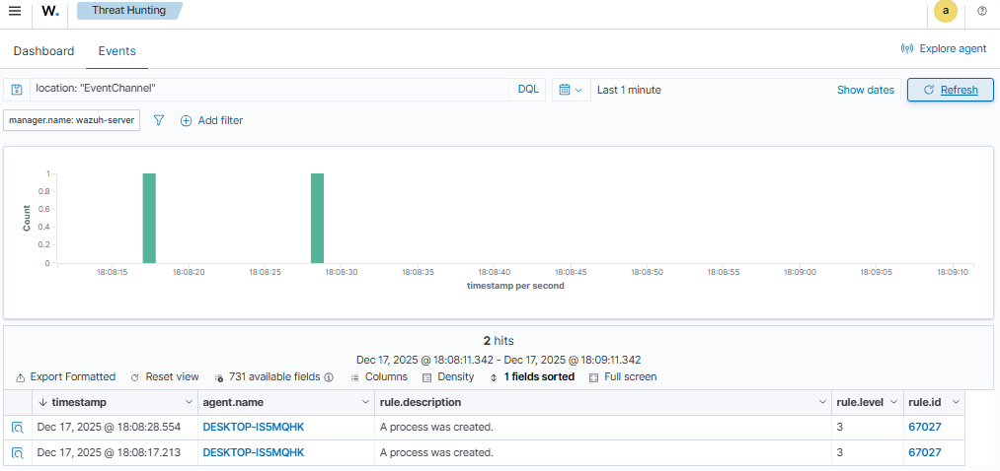

Figura 10 – Evento de creación de la tarea `WazuhFase2Task`
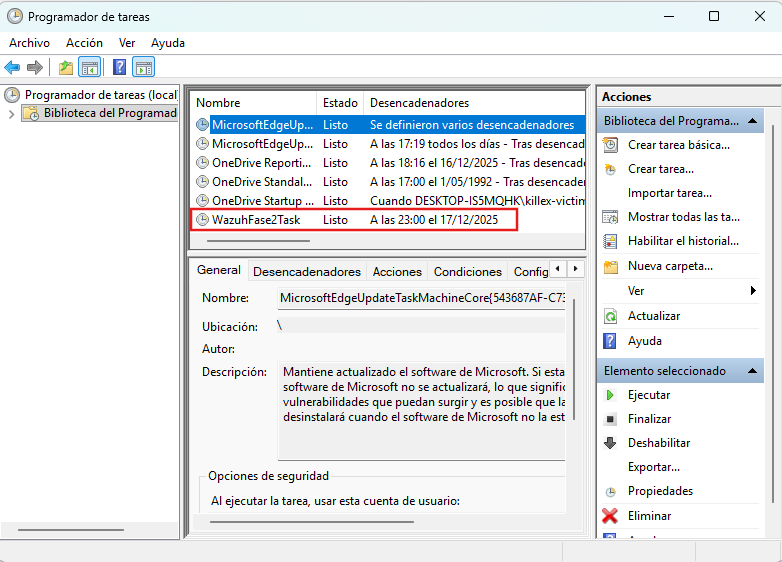


**Resultado**

- La creación de la tarea programada queda registrada en Threat Hunting.
    
- Actualmente no hay una regla local ni un mapeo directo a **T1053**:
    
    - **Estado:** Detectado como evento, **sin regla MITRE aún**.
        
    - Candidato claro para crear una regla local en Fase 3.

### 3.3 T1082 – System Information Discovery

**Objetivo**  
Confirmar que la enumeración básica del sistema (información de SO, red y cuentas) es visible vía Sysmon + Wazuh, aunque no exista todavía una regla MITRE específica.

**Comandos ejecutados en Windows 11 (CMD)**
```cmd
systeminfo
whoami /all
ipconfig /all
net user
```

**Búsquedas realizadas en Wazuh**

- Threat Hunting filtrando por:
    
    - `agent.name: "DESKTOP-IS5MQHK"`
        
    - `data.win.system.eventID: 1`
        
    - `data.win.eventdata.commandLine` conteniendo:
        
        - `systeminfo`
            
        - `whoami`
            
        - `ipconfig`
            
        - `net user`
            
**Evidencias**

Figura 11 – Procesos de enumeración (systeminfo, whoami, etc.) registrados en Threat Hunting:
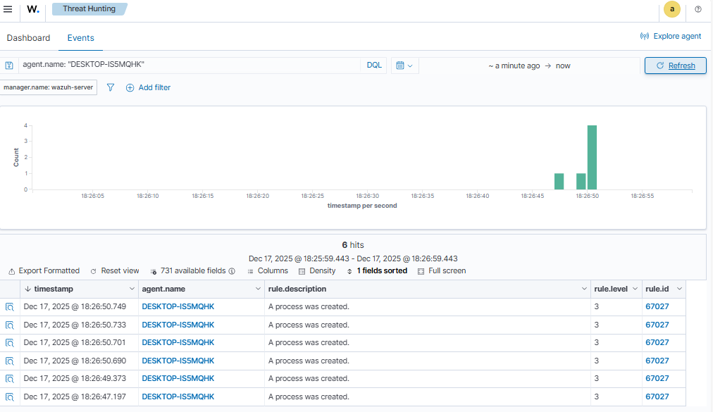

**Resultado**

- Sysmon registra las ejecuciones de los comandos de descubrimiento y Wazuh las muestra en Threat Hunting.
    
- No se observa una regla MITRE específica asociada a **T1082** por defecto.
    
- **Estado:** “Solo evento Sysmon, sin regla MITRE específica (por ahora)”.


### 3.4 Técnica T1082 – System Information Discovery (Windows 11 – Endpoint OPT1)

#### 3.4.1 Objetivo de la prueba

Validar que el laboratorio detecta actividades de **descubrimiento de información del sistema** realizadas desde el endpoint Windows 11, mapeadas a **MITRE ATT&CK T1082 – System Information Discovery**, utilizando:

- Eventos nativos de Windows (**Security / Event ID 4688**).
- Reglas locales en Wazuh que se apoyan en la regla base de creación de procesos (`67027`).

#### 3.4.2 Señal utilizada

Para esta técnica se aprovechó la telemetría ya disponible en el agente Windows 11:

- **Origen de eventos**:  
  - `data.win.system.channel: "Security"`  
  - `data.win.system.eventID: "4688"`  
  - `data.win.system.providerName: "Microsoft-Windows-Security-Auditing"`

- Regla base de Wazuh (ruleset por defecto):
  - `rule.id: 67027`  
  - `description: "A process was created."`  
  - `groups: ["windows", " WEF"]`

Esta regla 67027 actúa como “evento genérico” para cualquier creación de proceso.  
Sobre ella se construyó una regla **local** más específica para T1082.

#### 3.4.3 Regla local creada en Wazuh (T1082)

En el archivo del manager:

- Ruta: `/var/ossec/etc/rules/local_rules.xml`  
- Grupo creado:

```xml
<group name="local,windows,discovery,attack.t1082">

  <!-- T1082 sobre eventos Security 4688 -->
  <rule id="100130" level="7">
    <!-- Encadenamos con la regla genérica de proceso creado -->
    <if_sid>67027</if_sid>

    <!-- Comandos típicos de System Information Discovery -->
    <field name="win.eventdata.commandLine" type="pcre2">
      (?i)\b(systeminfo|whoami(\s+/all)?|ipconfig(\s+/all)?)\b
    </field>

    <description>System information discovery via built-in commands (ATT&amp;CK T1082)</description>
    <mitre><id>T1082</id></mitre>
    <group>discovery,mitre,</group>
  </rule>

</group>
```

**Puntos clave de la lógica:**
- Se usa `<if_sid>67027</if_sid>` para **encadenarse** a la regla base de creación de proceso.
- Se filtra por `win.eventdata.commandLine` usando una expresión regular PCRE2 que cubre:
    - `systeminfo`
    - `whoami /all`
    - `ipconfig /all`
- Se etiqueta con:
    - `group: discovery,mitre`
    - `mitre.id: T1082`

Esto permite distinguir las ejecuciones de _comandos de discovery_ de otros procesos legítimos que también generan 4688.

#### 3.4.4 Comandos ejecutados en el endpoint

Desde el equipo **Windows 11 (OPT1)** se ejecutaron manualmente los siguientes comandos:
```cmd
systeminfo
whoami /all
ipconfig /all
net user
```

- Los tres primeros (`systeminfo`, `whoami /all`, `ipconfig /all`) se usan para mapear **T1082 – System Information Discovery** mediante la regla local `100130`.
- `net user` se trata como **T1087 – Account Discovery** y **no** forma parte de la expresión regular de la regla `100130`.  
  Esta actividad se cubre ahora con:
  - la regla oficial de Sysmon `92031` (Process Create de `net.exe`/`net1.exe`), y
  - la regla local `100141` basada en Security 4688, descrita en la sección **3.8**.  
#### 3.4.5 Resultados de la detección
- En **Threat Hunting** se aplicaron los filtros:
    
    - Por ID de regla: `agent.name: "DESKTOP-IS5MQHK" AND rule.id: 100130
    
    - Por técnica MITRE: `agent.name: "DESKTOP-IS5MQHK" AND rule.mitre.id: "T1082"`

- Se observaron eventos generados por la ejecución de:
    - `systeminfo`
    - `whoami /all`
    - `ipconfig /all`
        
    con los campos relevantes:
    - `data.win.system.eventID: "4688"` 
    - `data.win.system.channel: "Security"`
    - `data.win.eventdata.commandLine` conteniendo el comando ejecutado.
    - `rule.id: 100130`
    - `rule.description: "System information discovery via built-in commands (ATT&CK T1082)"`.
    - `rule.mitre.id: ["T1082"]`
     
De forma paralela, la ejecución de `net user` quedó cubierta por dos reglas:
 - **Regla oficial Sysmon**  
  - `rule.id: 92031`  
  - `description: "Discovery activity executed"`  
  - `rule.mitre.id: ["T1087"]`  
  - `data.win.system.channel: "Microsoft-Windows-Sysmon/Operational"`  
  - `data.win.system.eventID: "1"`

- **Regla local basada en Security 4688**  
  - `rule.id: 100141`  
  - `description: "Account discovery via \"net user\" (ATT&CK T1087)"`  
  - `rule.mitre.id: ["T1087"]`  
  - `data.win.system.channel: "Security"`  
  - `data.win.system.eventID: "4688"`

De esta forma el laboratorio distingue entre **T1082 (systeminfo / whoami / ipconfig)** y **T1087 (net user)** usando tanto eventos de Security como de Sysmon.

#### 3.4.6 Evidencias y artefactos almacenados en el repositorio

En el repositorio `soc-wazuh-lab` se registraron las evidencias de esta técnica:
- **Configuración:**
    - `configs/wazuh/local_rules.xml`
        
        - Contiene la regla `100130` para T1082 (y el resto de reglas locales de Fase 1 y Fase 2).
            
- **Capturas de pantalla:**
    - Vista de Threat Hunting mostrando eventos generados por `systeminfo`, `whoami /all`, `ipconfig /all` con `rule.id: 100130`.
        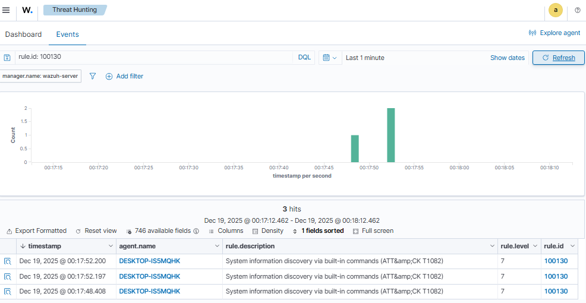
        
    - Panel MITRE → Events mostrando la técnica **T1082** asociada al agente `DESKTOP-IS5MQHK`
        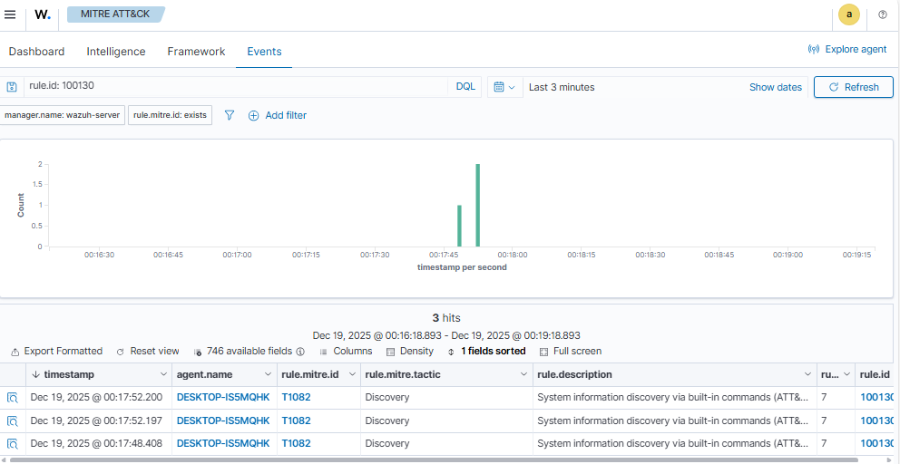

### 3.5 Técnica T1016 – System Network Configuration Discovery (Windows 11 – Endpoint OPT1)

#### 3.5.1 Objetivo de la prueba

Validar que el laboratorio detecta actividades de **descubrimiento de configuración de red** realizadas desde el endpoint Windows 11, mapeadas a **MITRE ATT&CK T1016 – System Network Configuration Discovery**, utilizando:

- Eventos nativos de Windows (**Security / Event ID 4688**).
- Reglas locales en Wazuh encadenadas a la regla base de creación de procesos (`67027`).

#### 3.5.2 Señal utilizada

Para esta técnica se reutilizó la misma fuente de telemetría de T1082:

- **Origen de eventos:**
  - `data.win.system.channel: "Security"`
  - `data.win.system.eventID: "4688"`
  - `data.win.system.providerName: "Microsoft-Windows-Security-Auditing"`

- **Regla base de Wazuh (ruleset por defecto):**
  - `rule.id: 67027`
  - `description: "A process was created."`
  - `groups: ["windows", " WEF"]`

Sobre esta regla se definió una regla local específica para comandos de **descubrimiento de red**.

#### 3.5.3 Regla local creada en Wazuh (T1016)

En el archivo de reglas locales del manager:

- Ruta: `/var/ossec/etc/rules/local_rules.xml`
- Grupo definido para T1016:

```xml
<group name="local,windows,discovery,attack.t1016">

  <!-- T1016 sobre eventos Security 4688 -->
  <rule id="100140" level="6">
    <if_sid>67027</if_sid>
    <!-- Comandos típicos de descubrimiento de configuración de red -->
    <field name="win.eventdata.commandLine" type="pcre2">(?i)\b(arp\s+-a|netstat(\s+-ano)?|route\s+print|ipconfig(\s+/all)?)\b</field>
    <description>System network configuration discovery via built-in commands (ATT&amp;CK T1016)</description>
    <mitre><id>T1016</id></mitre>
    <group>discovery,mitre,</group>
  </rule>

</group>
```
**Puntos clave de la lógica:**

- `<if_sid>67027</if_sid>` encadena la regla T1016 a la creación de proceso genérica.
    
- La condición sobre `win.eventdata.commandLine` busca comandos típicos de descubrimiento de red:
    
    - `arp -a`
    - `netstat -ano`
    - `route print`
    - `ipconfig /all` (compartido con T1082, pero aquí se usa también como indicador de descubrimiento de configuración de red).
- Se etiqueta con:
    - `group: discovery,mitre`
    - `mitre.id: T1016`
#### 3.5.4 Comandos ejecutados en el endpoint

Desde el equipo **Windows 11 (OPT1)** se ejecutaron manualmente los siguientes comandos de descubrimiento:
```cmd
arp -a
netstat -ano
route print
ipconfig /all
```

Estos comandos representan acciones habituales de un atacante para entender la **configuración de red**, interfaces, rutas y conexiones activas del sistema.
#### 3.5.5 Resultados de la detección

En el módulo **Threat Hunting** del dashboard de Wazuh se aplicaron los siguientes filtros:

- Por ID de regla:
    `rule.id: 100140`
- Por técnica MITRE:
    `rule.mitre.id: "T1016"`
Se observaron eventos asociados a la ejecución de:
- `arp -a`
- `netstat -ano`
- `route print`
- `ipconfig /all`

con los campos relevantes:
- `data.win.system.eventID: "4688"`
- `data.win.system.channel: "Security"`
- `data.win.eventdata.commandLine` conteniendo el comando ejecutado.
- `rule.id: 100140`
- `rule.description: "System network configuration discovery via built-in commands (ATT&CK T1016)"`
- `rule.mitre.id: ["T1016"]`

Lo anterior confirma que el laboratorio es capaz de identificar actividades de **enumeración de red** realizadas con herramientas nativas del sistema.
#### 3.5.6 Evidencias y artefactos almacenados en el repositorio

En el repositorio `soc-wazuh-lab` se registraron las evidencias de esta técnica:
- **Configuración:**
    
    - `configs/wazuh/local_rules.xml`
        
        - Contiene la regla `100140` para T1016, junto con el resto de reglas locales definidas en Fase 1 y Fase 2.
            
- **Capturas de pantalla:**
    
    - Vista de Threat Hunting mostrando eventos generados por `arp -a`, `netstat -ano`, `route print`, `ipconfig /all` con `rule.id: 100140`
        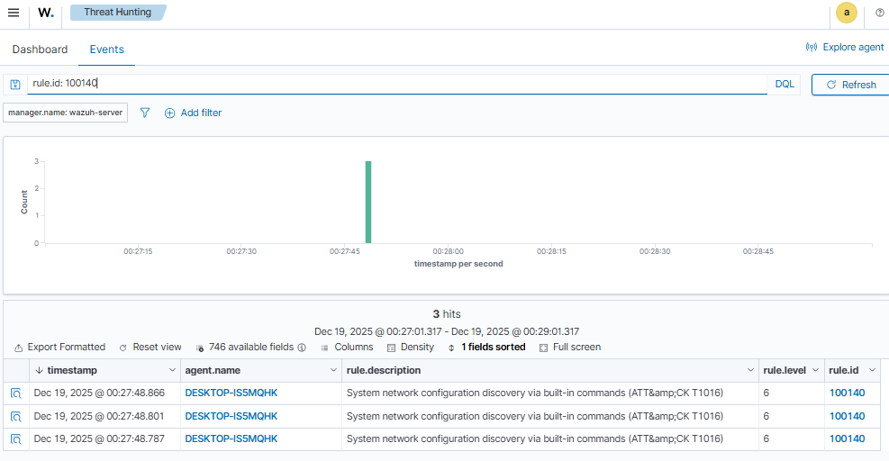
        
    - Panel MITRE → Events mostrando la técnica **T1016** asociada al agente `DESKTOP-IS5MQHK`.
        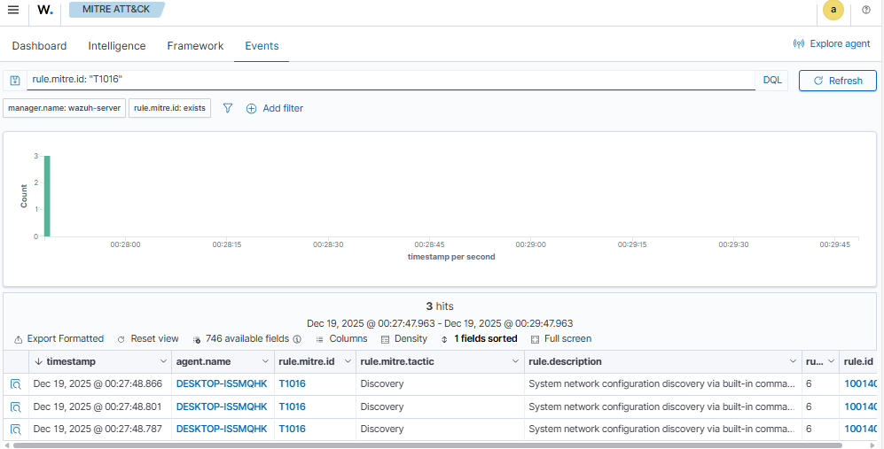

## 3.6. Técnica T1053.005 – Scheduled Task creation via `schtasks.exe`

### 3.6.1. Objetivo de la prueba

Detectar la creación de tareas programadas en Windows mediante el binario nativo `schtasks.exe`, mapeando la actividad a **MITRE ATT&CK T1053.005 – Scheduled Task/Job: Scheduled Task** y diferenciándola de otros eventos genéricos de creación de procesos (Event ID 4688).

### 3.6.2. Regla local en Wazuh

```xml
<group name="local,windows,persistence,attack,">

  <!-- T1053.005 - Scheduled Task creation via schtasks.exe -->
  <rule id="100150" level="10">
    <if_sid>67027</if_sid>
    
    <!-- Proceso schtasks.exe (cualquier ruta) -->
    <field name="win.eventdata.newProcessName" type="pcre2">(?i)schtasks\.exe$</field>
    
    <!-- Línea de comando con /create -->
    <field name="win.eventdata.commandLine" type="pcre2">(?i)/create</field>
    
    <description>Scheduled task creation via schtasks.exe (ATT&amp;CK T1053.005)</description>
    <mitre>
      <id>T1053.005</id>
    </mitre>
  </rule>

</group>

```
#### 3.6.2.1 Lógica de la regla

- **`<if_sid>67027</if_sid>`**  
    Reutiliza la regla base de Windows que ya detecta eventos **4688 – A process was created** en el canal `Security`.  
    Solo se evalúa esta regla cuando ya existe un evento de creación de proceso.
    
- **`win.eventdata.newProcessName` con `(?i)schtasks\.exe$`**  
    Asegura que el proceso creado sea `schtasks.exe`, independientemente de la ruta completa, usando una expresión regular case-insensitive.
    
- **`win.eventdata.commandLine` con `(?i)/create`**  
    Restringe la detección únicamente a ejecuciones de `schtasks.exe` que incluyan el parámetro `/create`, es decir, cuando realmente se está **creando una nueva tarea programada**, y no simplemente listando o modificando tareas.
    
- **MITRE y grupos**
    
    - `<mitre><id>T1053.005</id></mitre>` permite que el evento aparezca correctamente mapeado en el panel **MITRE → Events**.
        
    - `<group>persistence,mitre,</group>` clasifica la alerta dentro de las tácticas de **Persistencia** y la agrupa junto al resto de reglas MITRE locales.
        
### 3.6.3. Comando de prueba utilizado

En el endpoint Windows 11 (`DESKTOP-IS5MQHK`), se ejecutó:
```cmd
schtasks /create /sc once /tn "T1053_test" /tr "C:\Windows\System32\notepad.exe" /st 23:59
```

Este comando crea una tarea programada única (`/sc once`) llamada `T1053_test` que ejecuta `notepad.exe` a las 23:59.

### 3.6.4. Validación en Wazuh

En **Threat Hunting**, se validó que:

- El evento original llega como:
    
    - `data.win.system.channel: "Security"`
        
    - `data.win.system.eventID: 4688`
        
    - `data.win.eventdata.newProcessName: "C:\\Windows\\System32\\schtasks.exe"`
        
    - `data.win.eventdata.commandLine` contiene `schtasks /create ...`
        
- La alerta generada por Wazuh pasa de la regla genérica **67027 – "A process was created"** a la regla local:
    
    - `rule.id: 100150`
        
    - `rule.description: "Scheduled task creation via schtasks.exe (ATT&CK T1053.005)"`
        
    - `rule.level: 10`
        
    - `rule.mitre.id: "T1053.005"`
        

Filtros usados en Threat Hunting para evidenciarlo:

`agent.name: "DESKTOP-IS5MQHK" AND rule.id: 100150`

o bien:

`agent.name: "DESKTOP-IS5MQHK" AND rule.mitre.id: "T1053.005"`

### 3.6.5. Evidencias y artefactos almacenados en el repositorio

En el repositorio `soc-wazuh-lab` se registraron las evidencias de esta técnica:
- **Configuración:**
    
    - `configs/wazuh/local_rules.xml`
        
        - Contiene la regla `100150 para T1053.005, junto con el resto de reglas locales definidas en Fase 1 y Fase 2.
            
- **Capturas de pantalla:**
    
    - Vista de Threat Hunting mostrando eventos generados por `schtasks /create /sc once /tn "T1053_test" /tr "C:\Windows\System32\notepad.exe" /st 23:59` con `rule.id: 100150.
        
            
    - Panel MITRE → Events mostrando la técnica **T1053.005** asociada al agente `DESKTOP-IS5MQHK`.
        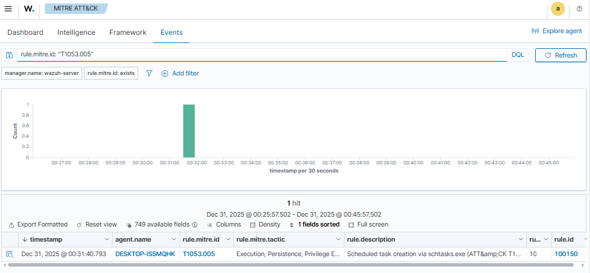

## 3.7. Técnica T1105 – Ingress Tool Transfer (descarga de herramienta vía PowerShell)

### Objetivo de la prueba

Validar la detección de la técnica **T1105 – Ingress Tool Transfer** cuando un atacante descarga un fichero hacia el endpoint Windows 11 usando **PowerShell**, y comprobar que:

- Sysmon genera eventos de **creación de proceso** y **creación de fichero**.
    
- Wazuh aplica las reglas del **ruleset oficial** (sin reglas locales adicionales).
    
- La técnica queda correctamente mapeada a **MITRE ATT&CK T1105** en el dashboard.
    
---
### 3.7.1 Reglas Wazuh implicadas

En esta prueba se observan **tres niveles de señal**:

1. **Windows Security – Event ID 4688 (creación de proceso)**
    
    - `data.win.system.channel: "Security"`
        
    - `data.win.system.eventID: 4688`
        
    - `rule.id: 67027`
        
    - `rule.description: "A process was created."`
        
    - Uso: sirve como señal genérica de creación de procesos (WEF), pero **no se usa** para mapear T1105 directamente.
        
2. **Sysmon – Event ID 1 (Process Create)**
    
    - `data.win.system.channel: "Microsoft-Windows-Sysmon/Operational"`
        
    - `data.win.system.eventID: 1`
        
    - `rule.id: 92027`
        
    - `rule.description: "Powershell process spawned powershell instance"`
        
    - `rule.mitre.id: "T1059.001"` (PowerShell – Execution)
        
    - Uso: confirma que la descarga se ejecuta mediante PowerShell (`Invoke-WebRequest`), y se asocia correctamente a **T1059.001 – Execution**.
        
3. **Sysmon – Event ID 11 (FileCreate) → Regla oficial T1105** ✅
    
    - `data.win.system.eventID: 11`
        
    - `rule.id: 92213`
        
    - `rule.description: "Executable file dropped in folder commonly used by malware"`
        
    - `rule.groups: ["sysmon", "sysmon_eid11_detections", "windows"]`
        
    - `rule.mitre.id: "T1105"`
        
    - Uso: esta es la **regla clave para T1105**. Detecta la creación de archivos ejecutables / scripts en ubicaciones típicas de malware (por ejemplo, `AppData\Local\Temp`), y ya viene en el **ruleset oficial de Wazuh**, por lo que **no fue necesario crear una regla local 100160 para esta técnica**.
        
Conclusión:  
Para **T1105 – Ingress Tool Transfer** la cobertura se consigue con:
- **Sysmon** como fuente de telemetría.
    
- **Regla oficial `92213`** (FileCreate en carpetas sospechosas).
    
- Mapeo directo a **MITRE T1105** sin reglas personalizadas.
    

---
### 3.7.2 Comando de prueba utilizado (Windows 11)

Desde el endpoint `DESKTOP-IS5MQHK` (red OPT1), se ejecutó:
```powershell
"C:\\Windows\\System32\\WindowsPowerShell\\v1.0\\powershell.exe" -NoProfile -Command "Invoke-WebRequest -Uri 'https://example.com' -OutFile $env:TEMP\fase2-t1105-test.txt"
```

Este comando simula a un atacante descargando una herramienta o payload en el directorio **Temp** del usuario, lo que encaja con la técnica **Ingress Tool Transfer**.

---
### 3.7.3 Evidencias en Wazuh

Tras ejecutar el comando se observaron, en orden temporal:

1. **Evento de creación de proceso (Security 4688)**
    
    - `newProcessName: "C:\\Windows\\System32\\WindowsPowerShell\\v1.0\\powershell.exe"`
        
    - `commandLine` incluye `Invoke-WebRequest ... -OutFile ...fase2-t1105-test.txt`
        
    - `rule.id: 67027` – alerta genérica _"A process was created"_.
        
2. **Sysmon EID 1 – Process Create (T1059.001)**
    
    - `data.win.system.eventID: 1`
        
    - `data.win.eventdata.image: "C:\\Windows\\System32\\WindowsPowerShell\\v1.0\\powershell.exe"`
        
    - `data.win.eventdata.commandLine` con el `Invoke-WebRequest -Uri 'https://example.com' ...`
        
    - `rule.id: 92027`
        
    - `rule.mitre.id: "T1059.001"` → ejecución vía PowerShell.
        
3. **Sysmon EID 11 – FileCreate en carpeta Temp (T1105)** ✅  
    Ejemplo de fragmento JSON:
    
    - `data.win.system.eventID: 11`
        
    - `data.win.eventdata.image: "C:\\WINDOWS\\System32\\WindowsPowerShell\\v1.0\\powershell.exe"`
        
    - `data.win.eventdata.targetFilename` en `C:\Users\killex-victim\AppData\Local\Temp\...ps1` o `fase2-t1105-test.txt`
        
    - `rule.id: 92213`
        
    - `rule.description: "Executable file dropped in folder commonly used by malware"`
        
    - `rule.mitre.id: "T1105"`
        
    - `rule.mitre.technique: "Ingress Tool Transfer"`
        
#### 3.7.3.1 Filtros utilizados en Threat Hunting

Para validar la cobertura:

- Filtro por MITRE:
    
`agent.name: "DESKTOP-IS5MQHK" AND rule.mitre.id: "T1105"`

- Filtro por regla específica:
    
`agent.name: "DESKTOP-IS5MQHK" AND rule.id: 92213`

En ambos casos se observan los eventos generados por Sysmon EID 11 asociados a la descarga en `AppData\Local\Temp`.

---

### 3.7.4 Evidencias y artefactos almacenados en el repositorio

En el repositorio `soc-wazuh-lab` se registraron las evidencias de esta técnica:
- **Configuración:**
  - `configs/wazuh/local_rules.xml`
    - No se añadieron reglas locales nuevas para T1105.  
      La detección se apoya en la regla oficial **92213** del ruleset de Sysmon (archivo de reglas por defecto de Wazuh).
            
- **Capturas de pantalla:**
    
    - Vista de Threat Hunting mostrando eventos generados por `powershell.exe -NoProfile -Command "Invoke-WebRequest -Uri 'https://example.com' -OutFile $env:TEMP\fase2-t1105-test.txt"` con `rule.id: 92213`.
        
           
    - Panel MITRE → Events mostrando la técnica **T1105** asociada al agente `DESKTOP-IS5MQHK`.
        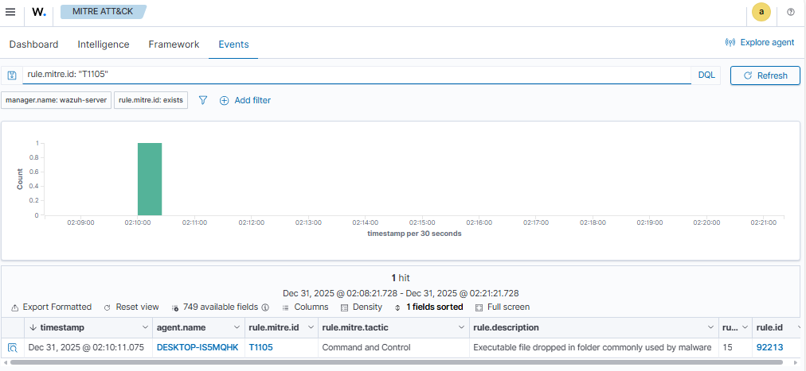

## 3.8. Técnica T1087 – Account Discovery vía `net user` (Windows 11 – Endpoint OPT1)

### 3.8.1 Objetivo de la prueba

Validar la detección de **Account Discovery** cuando se enumeran cuentas locales mediante el comando nativo `net user`, mapeando la actividad a **MITRE ATT&CK T1087 – Account Discovery** con:

- Eventos de **Security / 4688** (creación de proceso).
- Regla local en Wazuh encadenada a la regla base `67027`.
- Reglas oficiales de Sysmon como señal complementaria.

### 3.8.2 Regla local creada en Wazuh (T1087)

En el manager, dentro de `local_rules.xml` se añadió:

```xml
<group name="local,windows,discovery,attack.t1087">

  <!-- T1087 - Account discovery via "net user" -->
  <rule id="100141" level="7">
    <if_sid>67027</if_sid>

    <!-- Comando "net user" (net.exe o net1.exe, cualquier ruta) -->
    <field name="win.eventdata.commandLine" type="pcre2">(?i)\bnet(\.exe)?\s+user\b</field>

    <description>Account discovery via "net user" (ATT&amp;CK T1087)</description>
    <mitre><id>T1087</id></mitre>
    <group>discovery,mitre,</group>
  </rule>

</group>
```

**Lógica principal:**
- `<if_sid>67027</if_sid>` reutiliza la regla genérica **“A process was created”** sobre eventos 4688.
    
- El filtro en `win.eventdata.commandLine` busca el patrón `net user` (independiente de mayúsculas/minúsculas y con espacio variable).
    
- Se etiqueta la alerta como **T1087** y se añade a los grupos `discovery,mitre`.
### 3.8.3 Comandos ejecutados

Desde **Windows 11** se ejecutó: `net user`

El comando se lanzó tanto localmente como dentro de la sesión remota abierta desde Kali (psexec) lo cual lo veras también en la [[Fase3–Escenario-APT-encadenado]], lo que generó eventos 4688 y Sysmon EID 1 (`net.exe` / `net1.exe`).

### 3.8.4 Resultados en Wazuh

En **Threat Hunting** se validó con los filtros:

- `agent.name: "DESKTOP-IS5MQHK" AND rule.id: 100141`
    
- `agent.name: "DESKTOP-IS5MQHK" AND rule.mitre.id: "T1087"`
    
Campos relevantes observados:

- `data.win.system.channel: "Security"`
    
- `data.win.system.eventID: "4688"`
    
- `data.win.eventdata.commandLine: "net user"`
    
- `rule.id: 100141`
    
- `rule.description: "Account discovery via \"net user\" (ATT&CK T1087)"`
    
- `rule.mitre.id: ["T1087"]`
    
Además, en paralelo se siguió viendo la regla oficial:

- `rule.id: 92031` (Sysmon EID 1 – Process Create de `net.exe`/`net1.exe` mapeado a T1087).
    
### 3.8.5 Conclusión

- La técnica **T1087 – Account Discovery** queda cubierta por una combinación de:
    
    - **Regla local 100141** sobre eventos 4688 del canal Security.
        
    - **Regla oficial 92031** sobre eventos Sysmon EID 1.
        
- La nueva regla 100141 permite ver T1087 también cuando solo está disponible la telemetría de Security, manteniendo el mapeo correcto en el panel **MITRE → Events**.
## 4. Validación de ruido y estabilidad de reglas

### 4.1 Metodología de verificación

Tras finalizar las pruebas de la Fase 2, se dejó el endpoint Windows 11 (`DESKTOP-IS5MQHK`, red OPT1) **sin ejecutar actividad maliciosa ni comandos de prueba durante ~2 horas**.

En el módulo **Threat Hunting** de Wazuh se aplicó el siguiente filtro:
- `agent.name: "DESKTOP-IS5MQHK"`
    
- `manager.name: "wazuh-server"`
    
- `rule.id: (100100 OR 100110 OR 100111 OR 100120 OR 100121 OR 100130 OR 100150)`
    
Rango temporal:
- `Last 2 hours`.
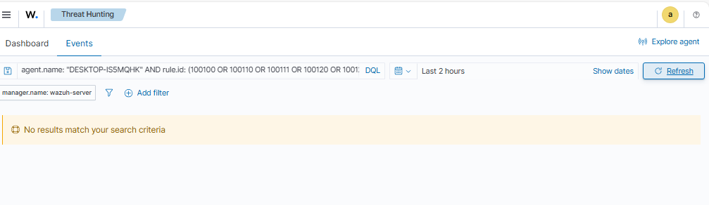

> (Vista Threat Hunting sin resultados para las reglas locales de Fase 2 en las últimas 2 horas).

### 4.2 Resultado

- El filtro devolvió **“No results match your search criteria”**.
    
- Es decir, durante el periodo observado:
    - Ninguna de las reglas locales de Fase 2 se disparó de forma espuria.
    - No se registraron falsos positivos para:
        - `100100` (T1059.001 – PowerShell con ExecutionPolicy Bypass).
        - `100110` / `100111` (T1543.003 – creación de servicios).
        - `100120` / `100121` (T1547.001 – claves Run / RunOnce).
        - `100130` (T1082 – System Information Discovery con `systeminfo`, `whoami /all`, `ipconfig /all`).
        - `100140` (T1016 – System Network Configuration Discovery con `arp -a`, `netstat -ano`, `route print`, `ipconfig /all`).
        - `100141` (T1087 – Account Discovery con `net user`).
        - `100150` (T1053.005 – creación de tareas programadas con `schtasks /create`).
### 4.3 Conclusión de ruido

- Las reglas locales creadas en la Fase 2 **aportan visibilidad MITRE adicional** sin introducir alertas constantes durante el uso normal del equipo.
- Para el alcance de este laboratorio, se considera que:
    - El **nivel de ruido es aceptable**.
    - Las reglas pueden mantenerse activas como parte de la configuración base del agente Windows 11.
## 5. Resumen de cobertura MITRE – Fase 2

| Técnica   | Táctica        | Fuente principal             | Tipo de regla           | rule.id         | Estado |
| --------- | -------------- | ---------------------------- | ----------------------- | --------------- | ------ |
| T1059.001 | Execution      | Sysmon + Security            | Local (ExecutionPolicy) | 100100          | OK     |
| T1543.003 | Persistence    | Security (7045/4697)         | Local                   | 100110 / 100111 | OK     |
| T1547.001 | Persistence    | Sysmon RegistryEvent         | Local                   | 100120 / 100121 | OK     |
| T1082     | Discovery      | Security 4688                | Local                   | 100130          | OK     |
| T1016     | Discovery      | Security 4688                | Local                   | 100140          | OK     |
| T1087     | Discovery      | Security 4688 + Sysmon EID 1 | Local + oficial         | 100141 / 92031  | OK     |
| T1053.005 | Persistence    | Security 4688                | Local                   | 100150          | OK     |
| T1105     | C2 / Execution | Sysmon EID 11                | Oficial (Sysmon rules)  | 92213           | OK     |

Con la Fase 2 se pasa de una configuración básica a un laboratorio capaz de:
- Detectar múltiples técnicas MITRE en el endpoint Windows 11.
- Diferenciar entre Execution, Persistence y Discovery.
- Combinar señales de:
  - Windows Security (4688, 7045, 4697).
  - Sysmon (EID 1, 11, RegistryEvent).
  - Reglas locales y reglas del ruleset oficial de Wazuh.
- Las reglas locales creadas **aportan visibilidad MITRE adicional** sin introducir ruido por falsos positivos.